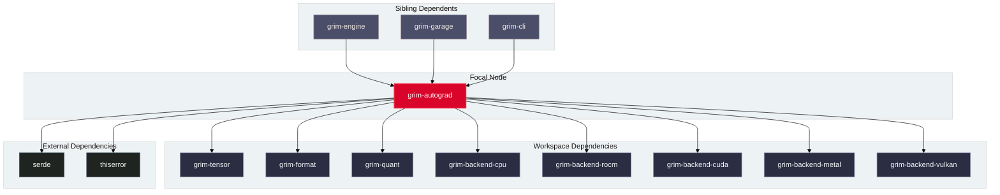

# `grim-autograd`

`grim-autograd` provides a reverse-mode automatic differentiation engine designed for parameter-efficient fine-tuning (LoRA, QLoRA, LoRA+, ReLoRA, OFT, PiSSA, OLoRA, Spectral QLoRA, and VeRA) and full-parameter training in Grim. It records execution tapes, computes exact gradients, and optimizes trainable parameters using mixed-precision AdamW and PagedAdamW.

## Boundaries

`grim-autograd` does **not**:
- Serve HTTP endpoints or handle network connections (delegated to `grim-server`).
- Manage continuous batching or inference scheduling (delegated to `grim-scheduler`).
- Implement compute shaders or HIP device kernel binaries directly (delegated to `grim-backend-*` crates).

## Dependency Graph



## Public API Overview

Exposed from `src/lib.rs`:

### Core Structs and Functions

```rust
/// Execution tape recording differentiable operations.
pub struct Tape {
    // nodes: Vec<TapeNode>
}

impl Tape {
    pub fn new() -> Self;
    pub fn is_empty(&self) -> bool;
    pub fn len(&self) -> usize;
    pub fn clear(&mut self);
    pub fn backward(&mut self, loss_grad: &Tensor) -> Result<(), Error>;
}

/// Trainable parameter representation tracking gradients and frozen status.
pub struct TrainableParam {
    pub id: usize,
    pub name: String,
    pub tensor: Tensor,
    pub grad: Option<Tensor>,
    pub frozen: bool,
}

/// Registry of trainable parameters.
pub struct TrainableParams {
    // params: Vec<TrainableParam>
}

impl TrainableParams {
    pub fn new() -> Self;
    pub fn register(&mut self, name: &str, tensor: Tensor) -> usize;
    pub fn zero_grad(&mut self) -> Result<(), Error>;
    pub fn get(&self, id: usize) -> Option<&TrainableParam>;
    pub fn get_mut(&mut self, id: usize) -> Option<&mut TrainableParam>;
}

/// AdamW optimizer with master precision and fp32 momentum.
pub struct AdamW {
    pub lr: f32,
    pub beta1: f32,
    pub beta2: f32,
    pub eps: f32,
    pub weight_decay: f32,
}

impl AdamW {
    pub fn new(lr: f32) -> Self;
    pub fn step(&mut self, params: &mut TrainableParams) -> Result<(), Error>;
}

/// Cross-entropy loss computation with backward gradient generator.
pub fn cross_entropy_loss(
    logits: &Tensor,
    targets: &[u32],
) -> Result<(Tensor, Tensor), Error>;

/// Preference loss functions for alignment tuning.
pub mod preference_loss {
    pub fn dpo_loss(chosen_logps: &[f32], rejected_logps: &[f32], beta: f32) -> (f32, Vec<f32>, Vec<f32>);
    pub fn grpo_loss(logits: &Tensor, rewards: &[f32], baseline: f32) -> Result<(Tensor, Tensor), Error>;
    pub fn kto_loss(chosen_logps: &[f32], rejected_logps: &[f32], beta: f32) -> (f32, Vec<f32>);
    pub fn simpo_loss(chosen_logps: &[f32], rejected_logps: &[f32], beta: f32, gamma: f32) -> (f32, Vec<f32>, Vec<f32>);
}

/// Adapter parameter initializers for standard and advanced PEFT variants.
pub mod registry {
    pub fn init_lora(shape: &Shape, rank: usize, alpha: f32, seed: u64) -> (Tensor, Tensor);
    pub fn init_pissa(weights: &Tensor, rank: usize) -> Result<(Tensor, Tensor, Tensor), Error>;
    pub fn init_spectral_qlora(weights: &Tensor, rank: usize, seed: u64) -> Result<(Tensor, Tensor), Error>;
}
```

## Usage Example

```rust
use grim_autograd::{Tape, TrainableParams, AdamW, cross_entropy_loss};
use grim_tensor::{Tensor, Shape, DType, Device};

fn main() -> Result<(), Box<dyn std::error::Error>> {
    let mut params = TrainableParams::new();
    let mut tape = Tape::new();

    // 1. Register trainable adapter weight
    let a_shape = Shape::new(vec![16, 4]);
    let a_tensor = Tensor::zeros(&a_shape, DType::F32, &Device::Cpu)?;
    let p_id = params.register("lora_a", a_tensor);

    // 2. Forward pass records differentiable operations into tape
    // tape.record_matmul(...)

    // 3. Compute loss and execute reverse-mode backward pass
    // let (loss, grad) = cross_entropy_loss(&logits, &targets)?;
    // tape.backward(&grad)?;

    // 4. Optimizer step updates registered weights
    let mut optimizer = AdamW::new(1e-4);
    optimizer.step(&mut params)?;
    params.zero_grad()?;

    Ok(())
}
```

## Use Cases

- Fine-tuning LoRA and QLoRA adapters on quantized 4-bit/8-bit base models.
- Executing direct preference optimization (DPO), group relative policy optimization (GRPO), KTO, and SimPO.
- Training with reproducible PRNG initialization via explicit `--seed`.
- Overfitting verification via `toy_overfit` pipeline.

## Edge Cases, Limitations, and Quirks

1. **Frozen Base Weight Protection**: Base weights are marked frozen (`frozen: true`). Accumulating gradients on frozen parameters is a no-op that avoids allocating gradient buffers.
2. **Device-First Embedding Backward**: Embedding gradient accumulation dispatches directly to GPU backends (`grim_embedding_backward`) when tensors reside in VRAM.
3. **Loss Masking**: Token padding positions in batched sequences are masked out with zero loss weight prior to computing gradients.

## Build Flags, Feature Flags, and Environment Variables

- `default`: Includes `[cuda-mem, rocm-mem, metal-mem, vulkan-mem]`.
- `cuda-mem`, `rocm-mem`, `metal-mem`, `vulkan-mem`: Activates memory dispatch backend bindings for target hardware platforms.
