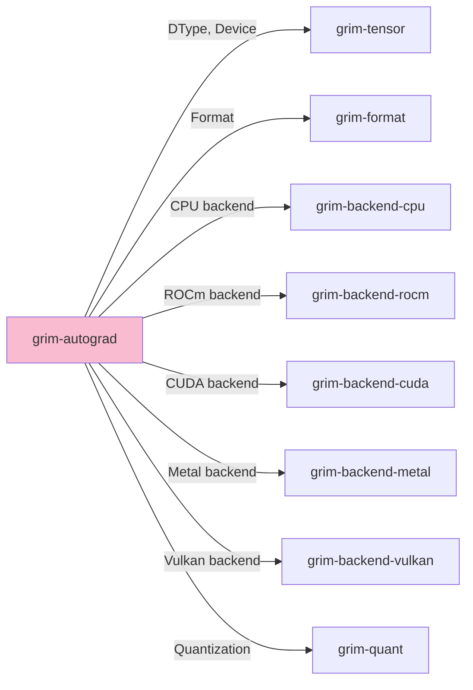

# grim-autograd

Scoped autograd for adapter-only backward pass (LoRA / QLoRA) — minimal reverse-mode tape over the trainable path only.

## Purpose

Provides autograd capabilities for training LoRA/QLoRA adapters:
- Reverse-mode automatic differentiation
- Tape-based gradient computation
- GPU/CPU backend support for gradient accumulation

Only traces the trainable path (adapter weights), not full model parameters.

## Boundaries

- Does not implement full model backpropagation — only for adapters
- Does not define optimizer logic — that's application-level
- Does not perform forward pass — see model crates

## Dependency Graph



## Public API

### GradTape

```rust
pub struct GradTape {
    // Reverse-mode tape for gradient computation
}

impl GradTape {
    pub fn new() -> Self;
    pub fn record<F>(&mut self, f: F) -> F::Output
    where F: FnOnce() -> F::Output;
    pub fn backward(&mut self, loss: &Tensor, retain_grad: bool) -> HashMap<String, Tensor>;
}
```

### LoRA Adaptors

```rust
pub struct LoRAAdaptor {
    pub up: Tensor,
    pub down: Tensor,
    pub alpha: f32,
}
```

## Usage Example

```rust
use grim_autograd::{GradTape, LoRAAdaptor};

let mut tape = GradTape::new();
let output = tape.record(|| model.forward(&input));
let loss = compute_loss(&output, &target);

let grads = tape.backward(&loss, false);
// grads contains gradients for adapter weights
```

## Feature Flags

| Flag | Default | Description |
|---|---|---|
| cuda-mem | - | Enable CUDA memory allocation |
| rocm-mem | - | Enable ROCm memory allocation |
| metal-mem | - | Enable Metal memory allocation |
| vulkan-mem | - | Enable Vulkan memory allocation |
| gpu-selection | - | Enable all GPU backends |

## Edge Cases

1. **In-place ops**: Not tracked in the tape; avoid modifying inputs
2. **Gradient accumulation**: Multiple backward calls accumulate on existing gradients
3. **Memory**: Tape grows with computation; clear after backward pass