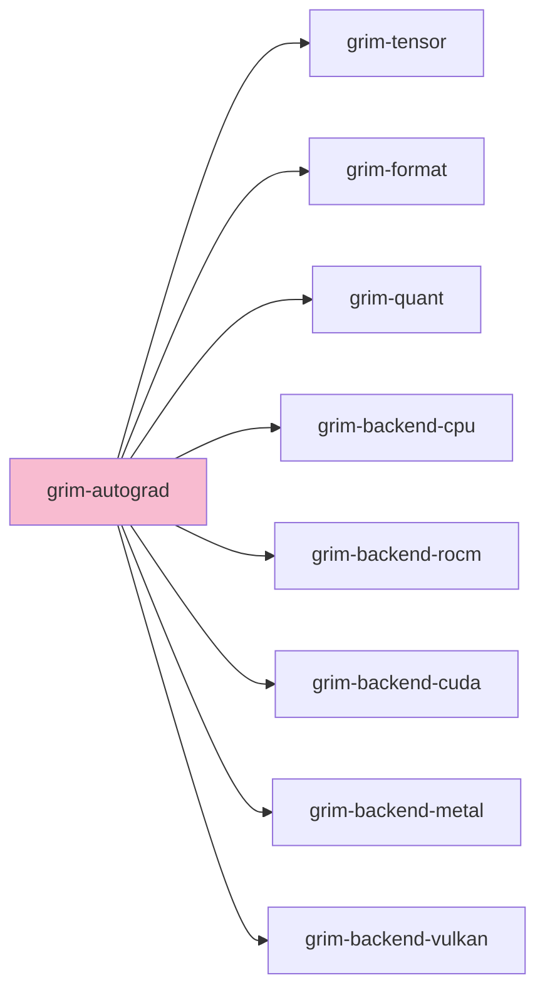

# grim-autograd

Scoped reverse-mode autodiff for adapter-only backward pass. Implements Unsloth-style QLoRA training: frozen base weights stay quantized, only LoRA adapter parameters require gradients, dequantization happens fused and just-in-time per op. WI-T1.

## Purpose

Provides a minimal, correctness-first reverse-mode tape recorder over the trainable path (adapter parameters + injection points). Only records `MatMul`, `Add`, and `Scale` ops — the exact op set QLoRA training exercises. Includes optimizers (AdamW, Adafactor, Lion, Muon), LoRA injection (`LoRAInjectionPoint`, `loftq_initialize`, `pissa_initialize`), loss functions (ContrastOmni, MM-GRPO preference loss), LR scheduling, and training utilities (`PackedBatch`, `TokenSequence`, `VarLenCollator`).

## Boundaries

- Does **not** autodiff the frozen base model weights — that is WI-T8's scope.
- Does **not** reimplement `grim-tensor-graph`'s fusion IR — it is a separate concern.
- Does **not** reach into backend kernel internals — goes through `BackendDevice` like existing forward code.
- Does **not** implement cross-entropy loss backward yet — that is slated for WI-T5.

## Dependency Graph



## Public API

```rust
pub enum AutogradScope { LoRAOnly, FullParameter }

impl Default for AutogradScope {
    fn default() -> Self { AutogradScope::LoRAOnly }
}

pub use scythe1::{Scythe1Adapter, Scythe1Optimizer};
pub use soul_eater::{SoulEaterAdapter, SoulEaterOptimizer};
pub use turbo_finetune::{TrainingMode, TurboFinituneConfig, TurboFinetuneScheduler};
pub use contrast_omni::{ContrastOmniConfig, ContrastOmniLoss};
pub use mm_grpo::{MmGrpoConfig, MmGrpoRewardNormalizer};

pub use adamw::{
    Adafactor, AdamW, Lion8Bit, Muon, Optimizer, OptimizerKind, PagedAdamW, LRScheduler,
};
pub use backward::{BackwardContext, backward};
pub use collate::{PackedBatch, TokenSequence, VarLenCollator};
pub use injection::{LoRAInjectionConfig, LoRAInjectionPoint, LoRAInjectionRegistry,
    loftq_initialize, pissa_initialize};
pub use param::{LoRAAdapterParams, LoRAParam};
pub use ops;
pub use tape::{AutogradTape, TapeOp};
```

## Feature Flags

| Flag | Default | Description |
|---|---|---|
| `cuda-mem` | yes | Enable CUDA memory allocation paths |
| `rocm-mem` | yes | Enable ROCm memory allocation paths |
| `metal-mem` | yes | Enable Metal memory allocation paths |
| `vulkan-mem` | yes | Enable Vulkan memory allocation paths |

## Edge Cases, Limitations, and Quirks

- `AutogradScope::Default` is `LoRAOnly` — full-parameter training is not yet wired.
- Cross-entropy loss backward is slated for WI-T5; currently loss is computed forward-only and gradients are injected via the adapter path.
- Optimizer state (AdamW moments) is kept in full precision even when base weights are quantized — this is the memory tradeoff QLoRA makes.
- The tape grows with computation graph size; callers should drop it after `backward` to release intermediate buffers.
