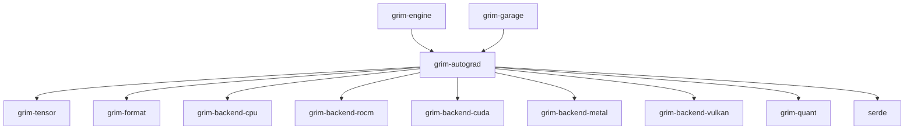

# grim-autograd

## Purpose
Provides a scoped, minimal reverse-mode autodiff tape specifically designed for adapter-only backward passes (LoRA / QLoRA). It tracks gradients exclusively for trainable adapter parameters while frozen base weights remain unquantized only during their localized forward and backward execution.

## Boundaries
- Does not compute gradients for frozen base weights.
- Operates on the established `BackendDevice` abstraction without reimplementing the fusion IR.
- Only records operations that touch adapter parameters (`MatMul`, `Add`, `Scale`).

## Dependency Graph


## Public API Overview
- `AutogradScope`: Enum determining which parameters are recorded (`LoRAOnly` or `FullParameter`).
- `Tape`: Core execution tape recording the forward pass of trainable ops.
- `BackwardContext`: Context handling the execution of the reverse mode tape.
- `TrainableParam` / `TrainableParams`: Structs encapsulating parameters that require gradients.
- `Optimizer` / `AdamW` / `PagedAdamW`: Trait and implementations for gradient application.
- `cross_entropy_loss` / preference losses (`dpo_loss`, `grpo_loss`): Implementations of standard loss functions with autograd hookups.

## Usage Example
```rust
use grim_autograd::{Tape, AutogradScope};

let mut tape = Tape::new();
// tape.register(tensors) and tape.record_matmul(...) used internally by adapter forward passes

// Context built from tape executes backward pass
// let ctx = BackwardContext::new(tape);
// ctx.backward(loss_tensor).unwrap();
```

## Use Cases
- Training LoRA adapters locally on consumer hardware.
- Serving memory-efficient QLoRA backward passes by materializing unquantized states just-in-time.
- Applying specialized preference optimization techniques like DPO, GRPO, or ORPO.

## Edge Cases, Limitations, and Quirks
- The tape only tracks explicitly supported ops; if an adapter introduces an unsupported operation, the backward pass will fail to calculate gradients.
- Assumes the underlying tensors resolve device placements correctly via `pick_device_for_tensor`.

## Build Flags, Feature Flags, and Environment Variables
- `default`: Includes `[cuda-mem, rocm-mem, metal-mem, vulkan-mem]`.
- `cuda-mem`, `rocm-mem`, `metal-mem`, `vulkan-mem`: Enables memory dispatch backend support for respective hardware.
- `gpu-selection`: Catch-all feature that enables all GPU memory backend flags.
