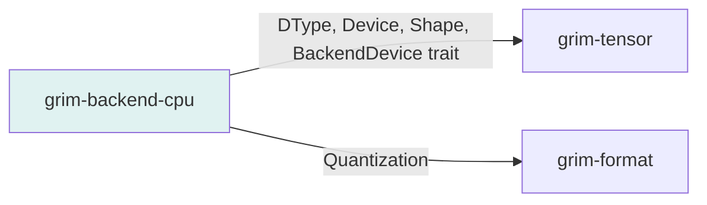

# grim-backend-cpu

CPU backend for Grim — reference implementation of BackendDevice. SIMD-accelerated where available, scalar fallback otherwise.

## Purpose

Provides the always-available CPU backend:
- Reference implementation for correctness
- SIMD-accelerated via OxiBLAS SIMD GEMM
- Scalar fallback for compatibility

## Boundaries

- Does not perform model architecture — only tensor operations
- Does not manage memory allocation directly
- Does not define the Device type — see `grim-tensor::dtype`

## Dependency Graph



## Public API

### CpuDevice

```rust
pub struct CpuDevice;
pub type CpuTensor = Box<dyn BackendStorage>;

/// Create a CPU tensor from vector data.
pub fn cpu_tensor(data: Vec<f32>, shape: Shape) -> CpuTensor;

/// Create zeros tensor on CPU.
pub fn cpu_zeros(shape: &Shape, dtype: DType) -> CpuTensor;
```

### BackendDevice Implementation

```rust
impl BackendDevice for CpuDevice {
    fn matmul(&self, a: &dyn BackendStorage, b: &dyn BackendStorage, 
              out: &Shape) -> Result<(Box<dyn BackendStorage>, Box<dyn ComputeHandle>)>;
    // ... other ops
}
```

## Feature Flags

| Flag | Default | Description |
|---|---|---|
| oxiblas | yes | Enable OxiBLAS SIMD GEMM (requires `matrixmultiply` feature) |

## Edge Cases

1. **SIMD availability**: Falls back to scalar GEMM if SIMD not available
2. **Feature disable**: `--no-default-features` disables OxiBLAS for fuzzing
3. **Deterministic RNG**: Provides `DeterministicRng` for reproducible inference