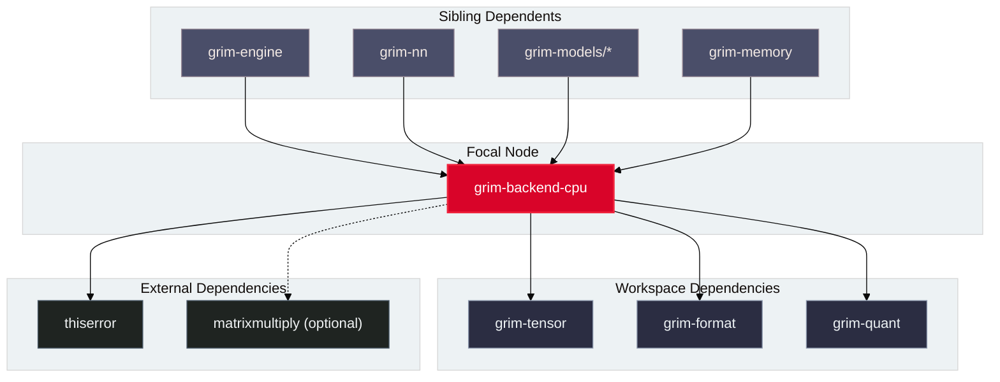

# grim-backend-cpu

## Purpose

`grim-backend-cpu` provides the host CPU compute backend and mathematical reference implementation for Grim. It executes tensor operations, fused activation kernels, AVX/NEON SIMD vector routines, and host GEMV matrix-vector products for concurrent MoE expert offloading.

## Boundaries

`grim-backend-cpu` does **not**:
- Dispatch operations to GPU devices or accelerator hardware (delegated to `grim-backend-rocm`, `grim-backend-cuda`, etc.).
- Parse model container files from disk (delegated to `grim-format`).
- Manage continuous batching or paged KV cache allocation (delegated to `grim-scheduler` and `grim-memory`).

## Dependency Graph



## Public API Overview

Exposed from `src/lib.rs`:

```rust
/// Primary CPU device implementation of the BackendDevice trait.
pub struct CpuDevice {
    // ...
}

/// Host CPU memory tensor buffer.
pub struct CpuStorage {
    // ...
}

/// Fast CPU GEMV matrix-vector multiplication kernel for MoE offloading.
pub fn cpu_gemv(a: &[f32], x: &[f32], m: usize, n: usize) -> Result<Vec<f32>, Error>;

/// Helper constructing an in-memory CPU tensor with explicit shape.
pub fn cpu_tensor(data: Vec<f32>, shape: grim_tensor::Shape) -> grim_tensor::Tensor;
```

## Usage Example

```rust
use grim_backend_cpu::gemv::cpu_gemv;

fn main() -> Result<(), Box<dyn std::error::Error>> {
    // Matrix A [2, 3], Vector x [3] -> Vector y [2]
    let a = vec![1.0, 2.0, 3.0, 4.0, 5.0, 6.0];
    let x = vec![0.5, 1.0, 2.0];

    let y = cpu_gemv(&a, &x, 2, 3)?;
    assert_eq!(y, vec![8.5, 19.0]);
    Ok(())
}
```

## Use Cases

- Executing reference tensor mathematics on systems without discrete GPU accelerators.
- Computing offloaded MoE expert layers concurrently in host system RAM to overlap PCIe transfer latency.
- Strict deterministic mathematical verification and fuzz testing of quantization and dequantization kernels.

## Edge Cases, Limitations, and Quirks

1. **Matrix Size Contract**: `cpu_gemv` strictly validates `a.len() == m * n` and `x.len() == n`, returning an explicit error upon shape mismatches.
2. **SIMD Availability**: High-throughput matrix multiplication relies on the `oxiblas` feature (`matrixmultiply` crate). In pure scalar fallback mode, throughput is bandwidth- and ALU-bound.

## Build Flags, Feature Flags, and Environment Variables

- `default`: Enables `oxiblas`.
- `oxiblas`: Pure-Rust SIMD-accelerated SGEMM/DGEMM without requiring C/Fortran compilers.
