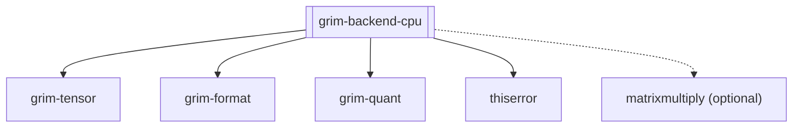

## Purpose
The `grim-backend-cpu` crate serves as the CPU reference implementation of the `BackendDevice` trait for the Grim engine. It executes neural network operations on the host CPU, falling back to scalar routines or leveraging SIMD-accelerated GEMM kernels when the `matrixmultiply` crate is used.

## Boundaries
This crate exclusively targets the host CPU. It handles CPU-specific memory allocation, thread dispatch, and computation kernels. It does not communicate with GPUs or network nodes. The SIMD performance bounds are limited to the capabilities of the host CPU (e.g., AVX2/SSE).

## Dependency Graph


## Public API Overview
- `CpuDevice`: The primary device struct implementing `BackendDevice`.
- `CpuStorage`: The CPU-resident memory buffer implementing `BackendStorage`.
- `CpuNumaTopology`: Structures representing NUMA node topologies for optimized allocation.
- `CpuHardwareSpec`: Profiles the host CPU's hardware characteristics (cache sizes, topology).
- `gemm_f32_simd`, `moe_fused_dispatch`: Low-level kernel implementations optimized for the CPU.

## Usage Example
```rust
use grim_backend_cpu::CpuDevice;
use grim_tensor::BackendDevice;

fn init_cpu() {
    // Initialize the CPU device for execution
    let device = CpuDevice::new();
    println!("CPU device initialized.");
}
```

## Use Cases
- Execution on environments lacking GPU hardware.
- Fuzzing, reference verification, and strict determinism testing.
- Executing small models or sub-graphs where CPU-GPU transfer latency outweighs computation time.

## Edge Cases, Limitations, and Quirks
- While SIMD acceleration is supported via `matrixmultiply`, the CPU is fundamentally slower at highly parallel workloads than accelerators.
- NUMA awareness is available but optimal thread pinning requires careful configuration to avoid cross-socket memory access overhead.

## Build Flags, Feature Flags, and Environment Variables
- `default`: Enables `oxiblas` feature.
- `oxiblas`: Pulls in `matrixmultiply` for pure-Rust SIMD-accelerated SGEMM/DGEMM without requiring C/Fortran toolchains. Disable (`--no-default-features`) for environments without SIMD or for fuzz testing.
