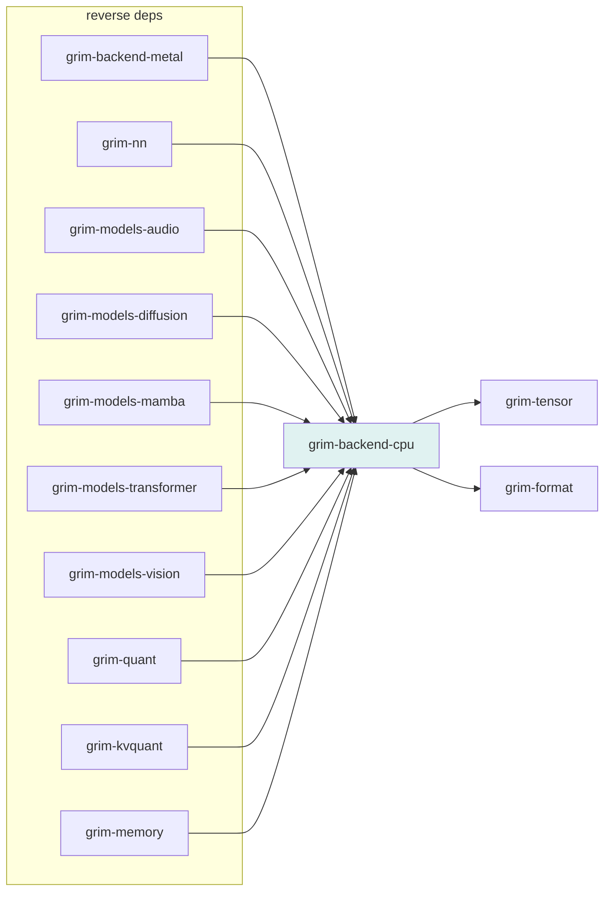

# grim-backend-cpu

CPU reference backend for Grim — host buffer storage, SIMD-accelerated GEMM, scalar fallback, and dequantization kernels.

## Purpose

Provides the always-available CPU backend: `CpuDevice`, `CpuStorage`, SIMD-accelerated GEMM (`gemm_f32_simd`, `gemm_f32_lora_fused`), dequantization (`dequant_row`), `DeterministicRng` for reproducible inference in Strict determinism mode, and strict-mode kernel primitives.

## Boundaries

- Does **not** define the `BackendDevice` or `BackendStorage` traits — those are declared in `grim-tensor`.
- Does **not** handle model loading or quantization format definitions — delegates to `grim-format` and `grim-quant`.
- Does **not** manage the GPU device list or ROCm/CUDA dispatch — it is CPU-only.

## Dependency Graph



## Public API

```rust
pub use device::{CpuDevice, add_tensors, cpu_tensor};
pub use storage::CpuStorage;
pub use deterministic_rng::DeterministicRng;
pub use dequant_gemm::dequant_row;
pub use simd_gemm::{gemm_f32_lora_fused, gemm_f32_simd};

pub mod dequant_gemm;
pub mod deterministic_rng;
pub mod device;
pub mod simd_gemm;
pub mod storage;
pub mod strict_kernels;
```

```rust
pub struct CpuDevice;
pub type CpuTensor = Box<dyn BackendStorage>;

pub fn cpu_tensor(data: Vec<f32>, shape: Shape) -> CpuTensor;
pub fn add_tensors(a: &CpuTensor, b: &CpuTensor) -> Result<CpuTensor>;
pub fn dequant_row(data: &[u8], num_weights: usize, scheme: QuantFormat) -> Vec<f32>;
pub fn gemm_f32_simd(a: &[f32], b: &[f32], m: usize, n: usize, k: usize) -> Vec<f32>;
pub fn gemm_f32_lora_fused(a: &[f32], b: &[f32], c: &[f32], m: usize, n: usize, k: usize) -> Vec<f32>;

pub struct DeterministicRng { /* u64 state */ }
impl DeterministicRng {
    pub fn next_u64(&mut self) -> u64;
    pub fn state(&self) -> u64;
}
```

## Usage Example

```rust
use grim_backend_cpu::CpuDevice;
use grim_tensor::{Shape, DType};

let device = CpuDevice;
let storage = device.zeros(&Shape(&[128, 256]), DType::F32);
```

## Edge Cases, Limitations, and Quirks

- SIMD GEMM falls back to scalar if AVX2/SSE is unavailable (compiled in).
- `DeterministicRng` is used in Strict determinism mode (§5.8) to ensure reproducible sampling without a global RNG.
- `dequant_row` handles Q4_K, Q8_0, and IQ-series formats via `grim_format::QuantFormat` — callers must pass the correct scheme.
