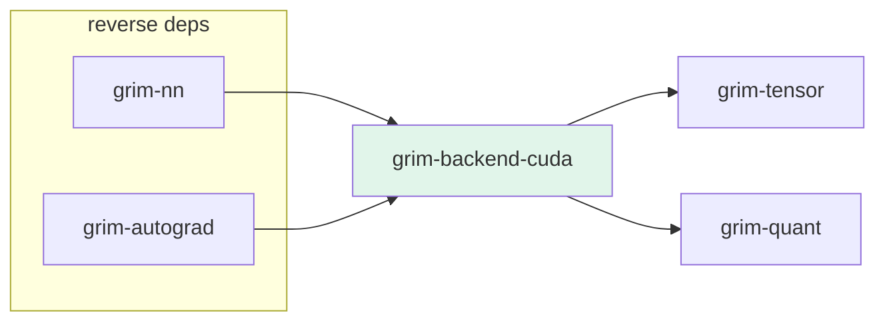

# grim-backend-cuda

CUDA backend for Grim — implements `BackendDevice` and `BackendStorage` traits from `grim-tensor` using direct FFI to the CUDA driver API and cuBLAS.

## Purpose

Provides `CudaDevice` and `CudaStorage` as the CUDA backend for tensor operations on NVIDIA GPUs. Uses direct FFI bindings to `cudaMalloc`, `cudaFree`, `cudaMemcpy`, and cuBLAS `cublasSgemm` rather than a crate wrapper.

## Boundaries

- Does **not** define the `BackendDevice` / `BackendStorage` traits — those are declared in `grim-tensor`.
- Does **not** provide fused or attention-specific kernels — GEMM-only; other ops fall back to CPU.
- Does **not** handle ROCm, Vulkan, or Metal dispatch — each has its own backend crate.

## Dependency Graph



## Public API

```rust
pub struct CudaDevice {
    pub(crate) ordinal: usize,
    cublas_handle: Arc<Mutex<Option<CublasHandle>>>,
}

pub struct CudaStorage { /* GPU memory handle + metadata */ }
pub struct CublasHandle(pub *mut c_void); // dropped → `cublasDestroy_v2`
pub struct CudaHandle { /* ... */ }
pub struct SendCmodule(pub CUmodule);

pub fn vram_info(ordinal: usize) -> Option<(u64, u64)>;
```

CUDA FFI constants:

```rust
pub const cudaSuccess: i32 = 0;
pub const cudaMemcpyHostToDevice: i32 = 1;
pub const cudaMemcpyDeviceToHost: i32 = 2;
pub const CUBLAS_STATUS_SUCCESS: i32 = 0;
pub const CUBLAS_OP_N: i32 = 0;
pub const CUBLAS_OP_T: i32 = 1;
```

CUDA FFI types:

```rust
pub type CUdevice = i32;
pub type CUcontext = *mut c_void;
pub type CUmodule = *mut c_void;
pub type CUfunction = *mut c_void;
pub type CUstream = *mut c_void;
```

## Feature Flags

This crate has no feature flags.

## Edge Cases, Limitations, and Quirks

- Many `BackendDevice` methods (sqrt, recip, attention) return `Err(Error::Unimplemented(...))` — callers must fall back to CPU for these.
- `vram_info` returns `Option` — `None` if the CUDA driver is unavailable.
- `CudaDevice` is `Send` via `SendCmodule` wrapper for raw module pointers.
- `CudaDevice` is pooled per ordinal: `CudaDevice::new(ordinal)` reuses one device (and one cuBLAS handle) per GPU for the process, so `to_cpu_vec_f32` on quantized weights no longer creates a cuBLAS handle per tensor. `CublasHandle` implements `Drop` and calls `cublasDestroy_v2` when the last `CudaDevice` clone sharing it is dropped.
