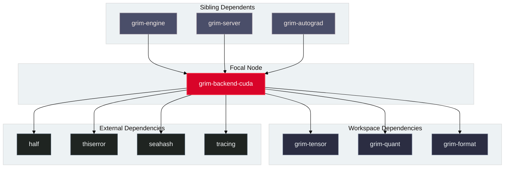

# `grim-backend-cuda`

`grim-backend-cuda` provides NVIDIA GPU hardware acceleration for Grim. It implements the `BackendDevice` trait, binding directly to the CUDA Driver and Runtime APIs, cuBLAS, and JIT-compiled PTX kernels for dense and quantized tensor math.

## Boundaries

`grim-backend-cuda` does **not**:
- Parse model file containers or deserialize weights (delegated to `grim-format`).
- Manage continuous batching queues or KV cache page tables (delegated to `grim-scheduler` and `grim-memory`).
- Implement autodiff tape recording (delegated to `grim-autograd`).

## Dependency Graph



## Public API Overview

Exposed from `src/lib.rs`:

### Core Structs and Types

```rust
/// NVIDIA CUDA GPU device handle.
pub struct CudaDevice {
    pub ordinal: usize,
    pub arch: String,
    // ...
}

impl CudaDevice {
    pub fn new(ordinal: usize) -> Result<Self, Error>;
    pub fn probe() -> Result<Vec<CudaDevice>, Error>;
    pub fn arch_name(&self) -> &str;
    pub fn vram_total_bytes(&self) -> usize;
    pub fn vram_free_bytes(&self) -> usize;
}

impl grim_tensor::BackendDevice for CudaDevice {
    // matmul, quant_matmul, rms_norm, rope, silu_mul, embedding, etc.
}

/// Device memory allocation in CUDA VRAM.
pub struct CudaStorage {
    pub device_ptr: Option<*mut std::ffi::c_void>,
    pub bytes: usize,
    pub ordinal: usize,
    // ...
}

/// Execution handle for tracking CUDA stream synchronization.
pub struct CudaHandle { /* ... */ }

impl grim_tensor::ComputeHandle for CudaHandle {
    fn synchronize(&self) -> Result<(), Error>;
    fn is_ready(&self) -> bool;
}
```

## Usage Example

```rust
use grim_backend_cuda::CudaDevice;
use grim_tensor::{BackendDevice, Shape, DType};

fn main() -> Result<(), Box<dyn std::error::Error>> {
    let devices = CudaDevice::probe()?;
    if let Some(dev) = devices.first() {
        println!("Detected CUDA GPU: {} ({})", dev.ordinal, dev.arch_name());
        let shape = Shape::new(vec![4, 4]);
        let storage = dev.zeros(&shape, DType::F32)?;
        println!("Allocated {} bytes in CUDA VRAM", storage.bytes());
    }
    Ok(())
}
```

## Use Cases

- Inference and fine-tuning execution on NVIDIA GPUs.
- Fused dequantization GEMM for Q8_0, Q4_K, Q5_K, and Q6_K quantized weights.
- Asynchronous kernel dispatch and stream synchronization.

## Edge Cases, Limitations, and Quirks

1. **NVCC Toolchain Requirement**: Custom CUDA kernels require `nvcc` in `$PATH` or specified via `NVCC` environment variable. Compiled PTX blobs are cached in `target/grim_cuda_cache` keyed by source hash and compute capability.
2. **Q8_0 Block Scale Lifetimes**: Quantized matrix multiplications preserve block scale host/device buffers across kernel launches to prevent use-after-free conditions.
3. **Stream Management**: Kernel dispatches and cuBLAS routines execute on per-device stream queues, synchronized via `CudaHandle`.

## Build Flags, Feature Flags, and Environment Variables

- **Default features**: None.
- **Environment variables**: `CUDA_PATH`, `NVCC`, `CUDA_VISIBLE_DEVICES`.
