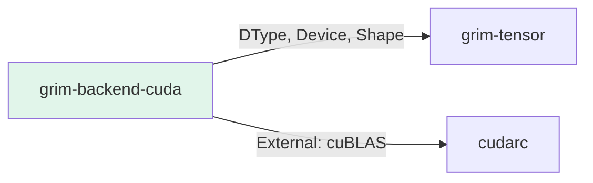

# grim-backend-cuda

CUDA (cudarc) compatibility backend for Grim.

## Purpose

CUDA backend for NVIDIA GPU support:
- cuBLAS-based GEMM operations
- CUDA-compatible tensor operations

## Boundaries

- Does not perform model architecture — only tensor operations
- Requires CUDA toolkit and compatible NVIDIA GPU
- Limited feature set compared to ROCm backend

## Dependency Graph



## Public API

### CudaDevice

```rust
pub struct CudaDevice {
    pub ordinal: usize,
}

impl BackendDevice for CudaDevice {
    // CUDA-specific implementations
}
```

## Feature Flags

This crate has no feature flags.

## Edge Cases

1. **Limited ops**: Many operations (sqrt, recip, attention) return `Unimplemented`
2. **cuBLAS only**: GEMM operations only, no fused kernels
3. **Memory**: CUDA memory management via cudarc crate