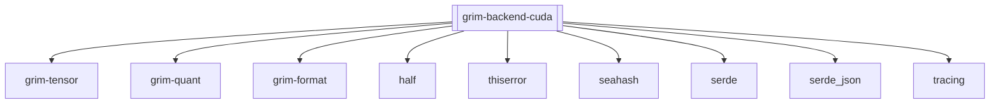

## Purpose
The `grim-backend-cuda` crate provides compatibility for NVIDIA GPU execution within the Grim engine. It implements the `BackendDevice` trait, binding directly to the CUDA runtime and cuBLAS library to enable high-performance operations on CUDA-capable architectures.

## Boundaries
This crate acts as a translation layer from the engine's generic tensor operations to native CUDA API calls. It handles raw FFI for `cudaMalloc`, `cudaMemcpy`, and kernel compilation (`nvcc`). It is strictly limited to CUDA hardware and does not bridge abstraction layers outside of fulfilling the `BackendDevice` trait.

## Dependency Graph


## Public API Overview
- `CudaDevice`: The core structure representing an active CUDA device and context.
- `CudaStorage`: Represents VRAM allocations accessible via standard CUDA memory pointers.
- `CudaHandle`: Represents the status of queued asynchronous CUDA operations.
- `CudaAutotuner`: Mechanisms for profiling and persisting optimal kernel configurations per device.
- `CudaCaps`: Hardware capability interrogation (e.g., compute capability, SM count).

## Usage Example
```rust
use grim_backend_cuda::CudaDevice;
use grim_tensor::BackendDevice;

fn init_cuda() {
    let ordinal = 0;
    if let Ok(device) = CudaDevice::new(ordinal) {
        println!("CUDA device initialized on ordinal {}", ordinal);
    }
}
```

## Use Cases
- Executing inference workloads efficiently on NVIDIA datacenters and consumer GPUs.
- Taking advantage of cuBLAS routines for dense matrix multiplication and custom JIT-compiled PTX kernels for quantized operations.

## Edge Cases, Limitations, and Quirks
- The crate shells out to `nvcc` at runtime for JIT compilation. The host machine *must* have the CUDA toolkit installed and `nvcc` accessible in the `$PATH` or specified via the `$NVCC` environment variable.
- It reuses cuBLAS handles in a global thread-safe pool to avoid context exhaustion overhead during heavy tensor initialization.

## Build Flags, Feature Flags, and Environment Variables
- `default`: No default features are enabled.
- Uses `NVCC` or `CUDA_PATH` environment variables during runtime JIT compilation if present.
