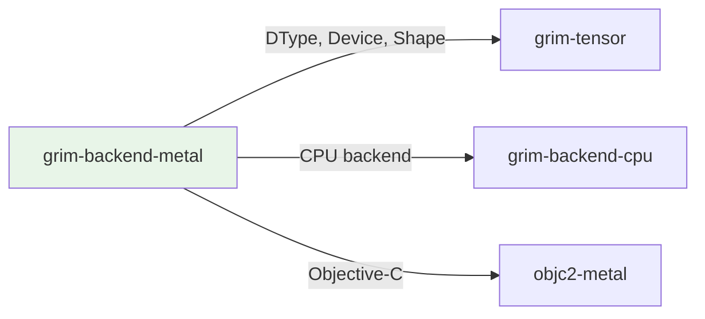

# grim-backend-metal

Metal compatibility backend for Grim.

## Purpose

Apple Silicon GPU backend:
- Metal compute shaders for GPU acceleration
- CPU fallback for non-Apple platforms
- Optimized for M-series chips

## Boundaries

- Only fully functional on macOS with Metal framework
- Linux builds compile but fall back to CPU
- Does not perform model architecture — only tensor operations

## Dependency Graph



## Public API

### MetalDevice

```rust
pub struct MetalDevice {
    pub ordinal: usize,
}

impl BackendDevice for MetalDevice {
    // Metal compute pipeline implementations
}
```

## Feature Flags

This crate has no feature flags.

## Edge Cases

1. **Platform-specific**: Only active on Apple Silicon; Intel Macs use CPU fallback
2. **Conditional dependencies**: `objc2` and `objc2-metal` only compiled on `target_vendor = "apple"`
3. **CPU fallback**: On non-Apple platforms, Metal device maps to CPU backend