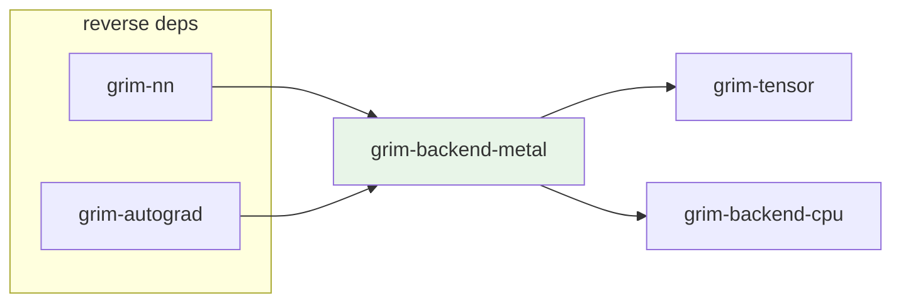

# grim-backend-metal

Metal compute backend for Grim — implements `BackendDevice` and `BackendStorage` traits from `grim-tensor` on Apple Silicon via the Objective-C Metal framework.

## Purpose

Provides `MetalDevice` and `MetalStorage` as the Metal backend for GPU tensor operations on Apple platforms. Integrates with `grim-backend-cpu` for CPU fallback paths.

## Boundaries

- Does **not** define the `BackendDevice` / `BackendStorage` traits — those are declared in `grim-tensor`.
- Does **not** provide the full ROCm backend feature set (no RCCL, no HIP graph capture).
- Does **not** handle model loading — see `grim-format`.

## Dependency Graph



## Public API

```rust
pub struct MetalDevice {
    pub ordinal: usize,
    inner: Option<Arc<MetalDeviceInner>>,
}

pub struct MetalStorage { /* Metal buffer handle */ }
pub enum MetalError { /* ... */ }
pub enum BufferUsage { /* ... */ }
pub struct MetalContext { /* ... */ }
pub struct MetalHandle { /* ... */ }
pub struct Tuner;
pub struct MetalTileConfig;
pub struct MlxBridge;

pub fn vram_info(_ordinal: usize) -> Option<(u64, u64)>;
```

The `MetalDeviceInner` struct (Apple-private, gated on `target_vendor = "apple"`) holds the Metal device protocol object.

## Feature Flags

This crate has no feature flags.

## Edge Cases, Limitations, and Quirks

- `objc2` and `objc2-metal` dependencies are only compiled when `target_vendor = "apple"` — on other platforms the crate compiles but Metal paths are unavailable.
- `MetalDevice` is a zero-sized type on non-Apple platforms — GPU operations return `Err(Error::Unimplemented(...))`.
- `MlxBridge` provides a bridge to Apple's MLX framework for certain tensor formats — only available on Apple Silicon.
