## Purpose
The `grim-backend-metal` crate implements the `BackendDevice` trait using Apple's Metal framework. It provides optimized execution on macOS/iOS devices leveraging Apple Silicon (M-series chips) and discrete AMD GPUs found in Macs.

## Boundaries
This crate strictly interfaces with the Metal ecosystem (`MTLDevice`, `MTLCommandQueue`, `MTLComputePipelineState`). It compiles Metal Shading Language (MSL) source files into executable compute pipelines. It handles memory sharing architecture specific to Apple Silicon (Unified Memory Architecture).

## Dependency Graph

```mermaid
graph TD
    grim-backend-metal[["grim-backend-metal"]]
    
    grim-tensor["grim-tensor"]
    grim-backend-cpu["grim-backend-cpu"]
    grim-quant["grim-quant"]
    grim-format["grim-format"]
    half["half"]
    thiserror["thiserror"]
    tracing["tracing"]
    seahash["seahash"]
    serde["serde"]
    serde_json["serde_json"]
    objc2["objc2 (target apple)"]
    objc2-metal["objc2-metal (target apple)"]
    
    grim-backend-metal --> grim-tensor
    grim-backend-metal --> grim-backend-cpu
    grim-backend-metal --> grim-quant
    grim-backend-metal --> grim-format
    grim-backend-metal --> half
    grim-backend-metal --> thiserror
    grim-backend-metal --> tracing
    grim-backend-metal --> seahash
    grim-backend-metal --> serde
    grim-backend-metal --> serde_json
    grim-backend-metal --> objc2
    grim-backend-metal --> objc2-metal
```


## Public API Overview
- `MetalDevice`: The primary device abstraction for Metal, retrieving the system default device and caching pipelines.
- `MetalStorage`: Wraps `MTLBuffer` allocating memory efficiently within the unified memory paradigm.
- `MetalHandle`: Wraps `MTLCommandBuffer` statuses to track compute shader completion.
- `MetalPipelines`: A structure containing pre-compiled handles to all MSL compute kernels (e.g., matrix multiplications, dequantization).

## Usage Example
```rust
use grim_backend_metal::MetalDevice;
use grim_tensor::BackendDevice;

fn init_metal() {
    let ordinal = 0;
    if let Ok(device) = MetalDevice::new(ordinal) {
        println!("Metal backend initialized successfully.");
    }
}
```

## Use Cases
- Running high-performance inference natively on MacBooks and Mac Studios.
- Exploiting Apple Unified Memory to process extremely large models where CPU RAM acts simultaneously as GPU VRAM.

## Edge Cases, Limitations, and Quirks
- Compiling MSL at runtime relies on shelling out to `xcrun` and generating temporary `.air` and `.metallib` files. It gracefully fails if the host does not have the Command Line Tools installed, provided a precompiled metallib wasn't embedded.
- For non-Apple platforms, this crate provides dummy types and safely stubs initialization, making cross-compilation configurations simpler.
- Buffers heavily rely on `StorageModeShared` to optimize for Unified Memory.

## Build Flags, Feature Flags, and Environment Variables
- `default`: No default features are enabled.
- Integrates conditionally on `cfg(target_vendor = "apple")`, enabling `objc2` bindings.
