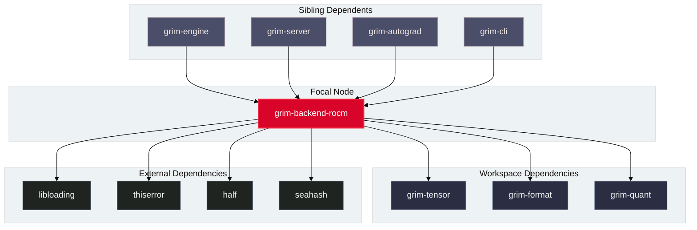

# `grim-backend-rocm`

`grim-backend-rocm` provides the primary GPU compute backend for Grim on AMD hardware. It encapsulates HIP runtime semantics, binding directly to HIP, rocBLAS, and RCCL shared libraries to execute hardware-accelerated tensor math, fused attention, quantized GEMM, distributed FSDP/ZeRO training collectives, and double-buffered MoE offload kernels.

## Boundaries

`grim-backend-rocm` does **not**:
- Parse model files from disk (delegated to `grim-format`).
- Implement inference scheduling, continuous batching, or KV cache eviction policies (delegated to `grim-scheduler` and `grim-memory`).
- Compute automatic differentiation tapes (delegated to `grim-autograd`).

## Dependency Graph



## Public API Overview

Exposed from `src/lib.rs`:

### Core Structs and Types

```rust
/// Primary ROCm GPU device handle executing HIP kernels and rocBLAS operations.
pub struct RocmDevice {
    pub ordinal: usize,
    pub arch: String,
    // ...
}

/// Device storage allocated in AMD GPU VRAM.
pub struct RocmStorage {
    pub(crate) device_ptr: Option<u64>,
    pub(crate) bytes: usize,
    // ...
}

/// Multi-GPU parallel communicator managing collective operations across GPU devices.
pub struct ParallelCommunicator {
    pub topology: ParallelTopology,
    pub backend: CommBackendType,
    // ...
}

impl ParallelCommunicator {
    pub fn all_gather_f32(&self, src: &[f32], dst: &mut [f32]) -> Result<(), Error>;
    pub fn all_gather_storage(&self, src: &RocmStorage, dst: &mut RocmStorage, stream_u64: u64) -> Result<(), Error>;
    pub fn reduce_scatter_sum_f32(&self, src: &[f32], dst: &mut [f32]) -> Result<(), Error>;
    pub fn reduce_scatter_storage(&self, src: &RocmStorage, dst: &mut RocmStorage, stream_u64: u64) -> Result<(), Error>;
    pub fn all_reduce_sum_storage(&self, storage: &mut RocmStorage, stream_u64: u64) -> Result<(), Error>;
}

/// Consumer Parallel GPU Multi-GPU FSDP (Fully Sharded Data Parallel) group.
pub struct ConsumerFsdpGroup {
    pub config: ConsumerFsdpConfig,
    pub comm: Option<Arc<ParallelCommunicator>>,
}

impl ConsumerFsdpGroup {
    pub fn execute_all_gather(&self, local_shard: &[f32], full_shape: &Shape) -> Result<Vec<f32>, Error>;
    pub fn execute_all_gather_storage(&self, local_shard: &RocmStorage, full_dst: &mut RocmStorage, stream: u64) -> Result<(), Error>;
    pub fn execute_reduce_scatter(&self, local_full_grad: &[f32], sharded_shape: &Shape) -> Result<Vec<f32>, Error>;
    pub fn execute_reduce_scatter_storage(&self, local_full_grad: &RocmStorage, sharded_dst: &mut RocmStorage, stream: u64) -> Result<(), Error>;
}

/// Fused RoPE + Scatter KV cache blending kernel reference.
pub fn blend_kv_rope_cpu(cfg: &BlendConfig, k_src: &[f32], v_src: &[f32], k_dst: &mut [f32], v_dst: &mut [f32]) -> Result<(), Error>;

/// Prefill hit compaction partitioning resident expert slots from PCIe cache misses.
pub fn compact_expert_requests(requested_experts: &[usize], cache_capacity: usize, resident_slots: &[Option<usize>]) -> Result<CompactedExpertSet, Error>;
```

## Usage Example

```rust
use std::sync::Arc;
use grim_backend_rocm::fsdp::{ConsumerFsdpConfig, ConsumerFsdpGroup};
use grim_backend_rocm::device::parallel_comm::{HostStagingRing, ParallelCommunicator};
use grim_tensor::Shape;

fn main() -> Result<(), Box<dyn std::error::Error>> {
    let world_size = 2;
    let ring = Arc::new(HostStagingRing::new(world_size));
    let comm = Arc::new(ParallelCommunicator::with_shared_staging(0, world_size, vec![0, 1], ring)?);

    let config = ConsumerFsdpConfig {
        world_size,
        rank: 0,
        peak_vram_budget_bytes: 16 * 1024 * 1024 * 1024,
    };
    let fsdp = ConsumerFsdpGroup::new(config, Some(comm))?;

    let full_shape = Shape::new(vec![4, 2]);
    let local_shard = vec![10.0f32, 20.0, 30.0, 40.0];
    let full_params = fsdp.execute_all_gather(&local_shard, &full_shape)?;
    assert_eq!(full_params.len(), 8);
    Ok(())
}
```

## Use Cases

- Primary GPU compute target for training and high-throughput inference on AMD Radeon (RDNA 3/4) and Instinct (CDNA) GPUs.
- Multi-GPU FSDP parameter sharding during training with real RCCL device collectives and high-speed host staging ring synchronization.
- Token-sorted grouped fused Charon MoE kernels for AWQ, CompressedTensors W8A8 (Int8/FP8), MXFP4, and IQ-family quantized expert banks.
- Prefill expert compaction and timeline overlap for offloaded MoE models.
- Fused KV cache prefix blending computing RoPE only on divergent token tails.

## Edge Cases, Limitations, and Quirks

1. **Dynamic Library Resolution**: `grim-backend-rocm` dynamically resolves `libamdhip64.so` and `librocblas.so` at runtime using `libloading`. If ROCm libraries are missing from `/opt/rocm/lib` or `LD_LIBRARY_PATH`, `RocmDevice::probe()` returns an empty list without panicking.
2. **RCCL Device Synchronization**: Real multi-GPU on-device collectives (`all_gather_storage`, `reduce_scatter_storage`) require valid GPU device pointers and stream synchronization. In environments without physical GPUs or RCCL, operations fall back to the mutex-synchronized `HostStagingRing`.
3. **Wavefront Size Specialization**: RDNA architectures (`gfx1030`, `gfx1100`, `gfx1151`, `gfx1200`) use Wave32 execution, while CDNA architectures (`gfx906`, `gfx908`, `gfx90a`, `gfx942`) use Wave64. Kernels are JIT-specialized using the device's native wavefront width.

## Build Flags, Feature Flags, and Environment Variables

- `default`: Enables `jit-hw-adaptive`.
- `jit-hw-adaptive`: Enables runtime compilation of HIP kernels via `hiprtc` tuned to detected hardware GCN architecture.
- `rccl`: Enables collective communication hooks for multi-GPU training.
- **Environment variables**: `ROCM_PATH`, `HIP_VISIBLE_DEVICES`, `GRIM_ROCM_DUMP_KERNELS`.
