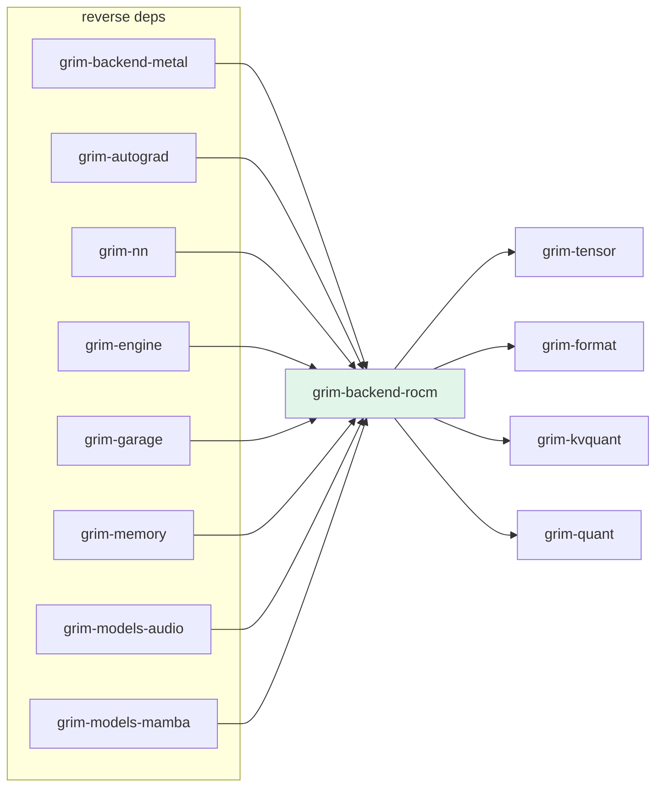

# grim-backend-rocm

ROCm (HIP/rocBLAS) backend for Grim — primary GPU target per architecture §4. Provides `RocmDevice`, `RocmStorage`, RCCL all-reduce, HIP graph capture, fused kernels, and quantization support.

## Purpose

Implements the `BackendDevice` and `BackendStorage` traits from `grim-tensor` for AMD GPUs via FFI to the HIP runtime (`libamdhip64.so`) and rocBLAS (`librocblas.so`). Also provides tensor-parallel communication (RCCL), graph capture/execution (HIP graphs), fused kernels (QKV attention, RMS-norm matmul, dequant-gemm), MIOpen dynamic loading, HSACO kernel JIT caching, and memory management (caching allocator, pinned buffers).

## Boundaries

- Does **not** define model architectures — see `grim-models-*`.
- Does **not** manage the KV cache block pool — see `grim-memory`.
- Does **not** implement CPU fallback — see `grim-backend-cpu`.
- Does **not** handle ROCm/GPU detection in the CLI — see `grim-core::env_config::Backend`.

## Dependency Graph



## Public API

### Core Device Types

```rust
pub use crate::device::roc_device::RocmDevice;
pub use crate::memory::storage::RocmStorage;
pub use crate::rccl::RcclAllReduce;
pub use grim_tensor::backend::{BackendDevice, BackendStorage, ComputeHandle};
```

### Memory and Allocation

```rust
pub use crate::memory::allocator::RocmCachingAllocator;
pub use crate::memory::pinned::RocmPinnedBuffer;
```

### Kernel and Compute

```rust
pub use crate::kernels::qkv_attention::{launch_paged_attention, launch_tree_attention};
pub use crate::kernels::source_asm::compute_kernel_source;
pub use crate::kernels::jit_cache::HsacoKernelCache;
pub use crate::gptq_kernel::wavefront_size_for_gcn;
pub use crate::device::helpers::{check_hip, jit_compile_hsaco, hipMemcpy, hipMalloc};
```

### Graph Capture

```rust
pub use crate::graph_capture::{CapturedGraph, HipGraphExecutor};
```

### rocBLAS

```rust
pub use crate::device::rocblas::{
    rocblas_sgemm, rocblas_create_handle, rocblas_destroy_handle,
    rocblas_set_stream, rocblas_datatype, select_gemm_algo,
    GemmTileConfig, lookup_gemm_config, lookup_solution_index,
};
```

### FSDP

```rust
pub mod fsdp;  // shard / unscale allreduce across TP ranks
```

### Layout and Quantization

```rust
pub use crate::device::layout::{
    KvLayout, WeightLayout, select_kv_layout, resolve_weight_layout,
    kv_from_block_major, kv_to_block_major,
};
pub use crate::device::capability_profiler::{CapabilityProfiler, vram_info};
pub use crate::quantization::QuantMode;
pub use crate::fusion::{
    DecodeGemmConfig, FusedDequantGemmConfig, KvDequantAttentionConfig,
    QkvAttentionFusionConfig, RmsNormMatMulFusionConfig, SplitKGemmConfig,
    WmmaGemmConfig,
};
```

## Feature Flags

| Flag | Default | Description |
|---|---|---|
| `rccl` | yes | Enable RCCL all-reduce for tensor-parallel communication |

## Usage Example

```rust
use grim_backend_rocm::RocmDevice;
use grim_tensor::{Device, Shape, DType};

let device = RocmDevice::new(0).unwrap(); // GPU ordinal 0
let storage = device.zeros(&Shape(&[128, 256]), DType::F32);
```

## Edge Cases, Limitations, and Quirks

- MIOpen is dynamically loaded via `libloading` at runtime; if the library is absent, operations requiring it return an error rather than panicking.
- HIP graph capture requires ROCm 6.0+; older SDKs fall back to non-captured execution.
- `RocmDevice` is `Send + Sync`, but GPU contexts are per-thread — callers must ensure consistent device affinity.
- JIT-compiled HSACO kernels are cached to the system temp directory; the cache is keyed by GCN arch and kernel source hash.
