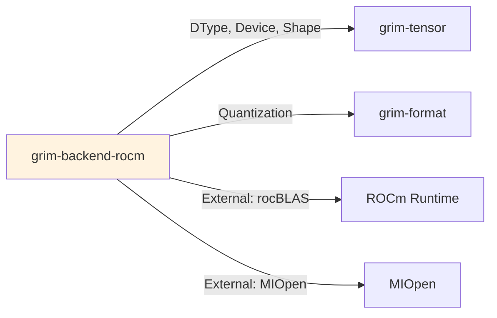

# grim-backend-rocm

ROCm (hip/rocBLAS) backend for Grim — primary GPU target per architecture §4.

## Purpose

Primary GPU backend implementation:
- rocBLAS for GEMM operations
- hip graph capture for kernel fusion
- Fused kernels for attention and MLP operations
- cubecl integration for modern kernel compilation

## Boundaries

- Does not perform model architecture — only tensor operations
- Does not manage memory allocation directly
- Requires ROCm runtime libraries to be installed

## Dependency Graph



## Public API

### RocmDevice

```rust
pub struct RocmDevice {
    pub ordinal: usize,
    pub gcn: String,
    pub tflops: f32,
}

impl BackendDevice for RocmDevice {
    // GPU-specific implementations of all BackendDevice ops
}
```

### GPU Capability Profiling

```rust
pub fn probe_host_gpu(ordinal: usize) -> Result<GpuCapability>;
pub fn probe_all_gpus() -> Result<Vec<GpuCapability>>;
```

## Feature Flags

| Flag | Default | Description |
|---|---|---|
| rocm-profile | - | Enable ROCm profiling |
| rocm-aiter | - | Enable AI tensor operations |
| rocm-kernel-macros | - | Enable kernel macro compilation |
| cubecl | - | Enable cubecl integration |
| rccl | - | Enable RCCL collective operations |

## Edge Cases

1. **GCN target**: Use `GRIM_GPU_TARGET` env var for specific architecture
2. **Kernel cache**: JIT-compiled kernels cached to `GRIM_HSACO_CACHE_DIR`
3. **Graph capture**: hip graph capture may be disabled via `GRIM_CAPTURE_GRAPH`