## Purpose
The `grim-backend-rocm` crate provides the primary GPU execution target for the Grim engine on AMD hardware. It encapsulates ROCm runtime semantics, binding directly to HIP and rocBLAS to perform highly optimized hardware-accelerated tensor operations.

## Boundaries
This crate strictly concerns itself with ROCm ecosystem interoperability (HIP, rocBLAS, RCCL). It interfaces directly with native shared libraries via dynamic loading or FFI. It does not handle general GPU abstractions beyond what is necessary to satisfy the `BackendDevice` contract for AMD environments.

## Dependency Graph

```mermaid
graph TD
    grim-backend-rocm[["grim-backend-rocm"]]
    
    grim-tensor["grim-tensor"]
    grim-format["grim-format"]
    grim-quant["grim-quant"]
    thiserror["thiserror"]
    log["log"]
    half["half"]
    seahash["seahash"]
    lazy_static["lazy_static"]
    temp-env["temp-env"]
    serde["serde"]
    serde_json["serde_json"]
    libloading["libloading"]
    cubecl["cubecl (optional)"]
    cubecl-hip["cubecl-hip (optional)"]
    cubecl-hip-sys["cubecl-hip-sys (optional)"]
    cubecl-runtime["cubecl-runtime (optional)"]
    cc["cc (build)"]
    
    grim-backend-rocm --> grim-tensor
    grim-backend-rocm --> grim-format
    grim-backend-rocm --> grim-quant
    grim-backend-rocm --> thiserror
    grim-backend-rocm --> log
    grim-backend-rocm --> half
    grim-backend-rocm --> seahash
    grim-backend-rocm --> lazy_static
    grim-backend-rocm --> temp-env
    grim-backend-rocm --> serde
    grim-backend-rocm --> serde_json
    grim-backend-rocm --> libloading
    grim-backend-rocm -.-> cubecl
    grim-backend-rocm -.-> cubecl-hip
    grim-backend-rocm -.-> cubecl-hip-sys
    grim-backend-rocm -.-> cubecl-runtime
```


## Public API Overview
- `RocmDevice`: The primary device implementation managing the ROCm context and executing kernels.
- `RocmStorage`: The HIP-managed memory buffer living in VRAM.
- `HipGraphExecutor`: Implementation of graph capture and replay for low-latency batch execution.
- `RocmCachingAllocator`: Advanced VRAM allocator for reducing `hipMalloc` / `hipFree` overhead.
- `CapabilityProfiler`: Interrogates device limits (e.g., maximum threads, available VRAM, arch).

## Usage Example
```rust
use grim_backend_rocm::RocmDevice;
use grim_tensor::BackendDevice;

fn init_rocm() {
    let ordinal = 0;
    // Attempt to initialize the ROCm device on GPU 0
    if let Ok(device) = RocmDevice::new(ordinal) {
        println!("ROCm device initialized on ordinal {}", ordinal);
    }
}
```

## Use Cases
- High-performance, large-batch LLM inference on AMD hardware (MI-series, RX-series).
- Serving multi-GPU distributed deployments using RCCL for collective operations.
- JIT-compiling customized GPU kernels adaptive to specific AMD architectures (RDNA/CDNA).

## Edge Cases, Limitations, and Quirks
- The crate heavily depends on dynamic loading of system shared libraries (`libamdhip64.so`, `librocblas.so`). If these are missing or mismatched at runtime, the backend initialization will fail cleanly.
- Graph capture features (`hipGraphCreate`) enforce strict requirements on kernel synchronization and streams.

## Build Flags, Feature Flags, and Environment Variables
- `default`: Enables `jit-hw-adaptive`.
- `jit-hw-adaptive`: Enables hardware-adaptive JIT compilation via `hiprtc`, substituting specific wavefront and cache tile macros tailored to the detected GPU architecture.
- `multi-gpu-kernel`: Unlocks multi-GPU kernel launch and RCCL bindings. Requires valid P2P interconnects and RCCL library availability.
- `rccl`: Specifically enables the RCCL collective communication wrappers.
- `cubecl`: Pulls in CubeCL frameworks for compute shader pipelines.
