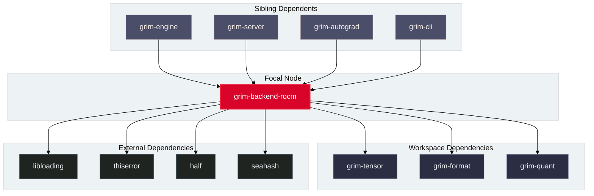

# `grim-backend-rocm`

`grim-backend-rocm` provides the primary GPU compute backend for Grim on AMD hardware. It encapsulates HIP runtime semantics, binding directly to HIP, rocBLAS, and RCCL shared libraries to execute hardware-accelerated tensor math, fused attention, quantized GEMM, and training kernels.

## Boundaries

`grim-backend-rocm` does **not**:
- Parse model files from disk (delegated to `grim-format`).
- Implement inference scheduling, continuous batching, or KV cache eviction policies (delegated to `grim-scheduler` and `grim-memory`).
- Compute automatic differentiation tapes (delegated to `grim-autograd`).

## Dependency Graph



## Public API Overview

Exposed from `src/lib.rs`:

### Core Structs and Types

```rust
/// Primary ROCm GPU device handle executing HIP kernels and rocBLAS operations.
pub struct RocmDevice {
    pub ordinal: usize,
    pub arch: String,
    // ...
}

impl RocmDevice {
    pub fn new(ordinal: usize) -> Result<Self, Error>;
    pub fn probe() -> Result<Vec<RocmDevice>, Error>;
    pub fn arch_name(&self) -> &str;
    pub fn vram_total_bytes(&self) -> usize;
    pub fn vram_free_bytes(&self) -> usize;
}

impl grim_tensor::BackendDevice for RocmDevice {
    // matmul, quant_matmul, rms_norm, rope, silu_mul, embedding, etc.
}

/// Device storage allocated in AMD GPU VRAM.
pub struct RocmStorage {
    pub device_ptr: *mut std::ffi::c_void,
    pub bytes: usize,
    // ...
}

/// Autotuner configuration for block size and occupancy selection.
#[derive(Debug, Clone)]
pub struct AutotunerConfig {
    pub block_size_band: BlockSizeBand,
    pub wave_size: u32,
}

#[derive(Debug, Clone, Copy, PartialEq, Eq)]
pub enum BlockSizeBand {
    Small,
    Medium,
    Large,
}
```

## Usage Example

```rust
use grim_backend_rocm::RocmDevice;
use grim_tensor::{BackendDevice, Shape, DType};

fn main() -> Result<(), Box<dyn std::error::Error>> {
    let devices = RocmDevice::probe()?;
    if let Some(dev) = devices.first() {
        println!("Detected ROCm GPU: {} (Arch: {})", dev.ordinal, dev.arch_name());
        let shape = Shape::new(vec![4, 4]);
        let storage = dev.zeros(&shape, DType::F32)?;
        println!("Allocated {} bytes in VRAM", storage.bytes());
    }
    Ok(())
}
```

## Use Cases

- Primary GPU compute target for training and high-throughput inference on AMD Radeon and Instinct GPUs.
- Native token-sorted grouped fused Charon MoE kernels for AWQ, CompressedTensors W8A8 (Int8/FP8), MXFP4, and IQ-family quantized expert banks.
- Native AWQ dequant-GEMM forward and backward operations (`grim_awq_dequant_gemm`, `grim_awq_dequant_backward_gemm`).
- Fused token embedding backward gradient aggregation (`grim_embedding_backward`).
- Hardware-adaptive kernel selection tuning for Wave32 (RDNA) and Wave64 (CDNA) architectures.

## Edge Cases, Limitations, and Quirks

1. **Dynamic Library Resolution**: `grim-backend-rocm` dynamically resolves `libamdhip64.so` and `librocblas.so` at runtime using `libloading`. If ROCm libraries are missing from `/opt/rocm/lib` or `LD_LIBRARY_PATH`, `RocmDevice::probe()` returns an empty list without panicking.
2. **Wavefront Size Specialization**: RDNA architectures (`gfx1030`, `gfx1100`, `gfx1151`, `gfx1200`) use Wave32 execution, while CDNA architectures (`gfx906`, `gfx908`, `gfx90a`, `gfx942`) use Wave64. Kernels are JIT-specialized using the device's native wavefront width.
3. **APU Managed Memory**: On APUs sharing unified memory with the host, memory allocations fall back to host-visible GTT pools when VRAM limits are approached.

## Build Flags, Feature Flags, and Environment Variables

- `default`: Enables `jit-hw-adaptive`.
- `jit-hw-adaptive`: Enables runtime compilation of HIP kernels via `hiprtc` tuned to detected hardware GCN architecture.
- `rccl`: Enables collective communication hooks for multi-GPU training.
- **Environment variables**: `ROCM_PATH`, `HIP_VISIBLE_DEVICES`, `GRIM_ROCM_DUMP_KERNELS`.
