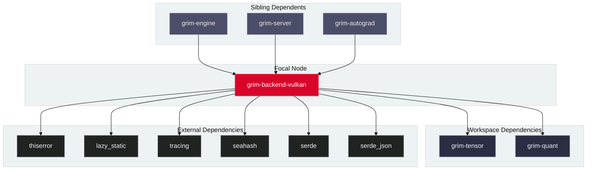

# `grim-backend-vulkan`

`grim-backend-vulkan` provides hardware acceleration for Grim using the Vulkan compute API. It compiles and dispatches SPIR-V compute pipelines across AMD, NVIDIA, Intel, and mobile GPUs.

## Boundaries

`grim-backend-vulkan` does **not**:
- Handle Vulkan graphics pipelines, swapchains, or window presentation.
- Parse GGUF/SafeTensors model weight files (delegated to `grim-format`).
- Manage continuous batching or KV cache allocation policies (delegated to `grim-scheduler` and `grim-memory`).

## Dependency Graph



## Public API Overview

Exposed from `src/lib.rs`:

### Core Structs and Types

```rust
/// Vulkan compute device handle.
pub struct VulkanDevice {
    pub caps: VulkanCaps,
    // ...
}

impl VulkanDevice {
    pub fn new() -> Self;
    pub fn probe() -> Result<Vec<VulkanDevice>, Error>;
    pub fn caps(&self) -> &VulkanCaps;
    pub fn hw_fingerprint(&self) -> u64;
}

impl grim_tensor::BackendDevice for VulkanDevice {
    // matmul, quant_matmul, rms_norm, rope, silu_mul, embedding, etc.
}

/// Device storage allocated in Vulkan buffer memory.
pub struct VulkanStorage {
    // buffer: u64,
    // memory: u64,
    // bytes: usize,
    // host_visible: bool,
}

/// Hardware capabilities and feature support descriptor.
#[derive(Debug, Clone, PartialEq, Eq, Hash)]
pub struct VulkanCaps {
    pub device_name: String,
    pub vendor_id: u32,
    pub device_id: u32,
    pub driver_version: u32,
    pub max_shared_memory_bytes: u32,
    pub max_workgroup_invocations: u32,
    pub max_workgroup_size: [u32; 3],
    pub supports_fp16: bool,
    pub supports_bf16: bool,
    pub supports_fp8: bool,
    pub supports_fp32_atomic_add: bool,
}
```

## Usage Example

```rust
use grim_backend_vulkan::VulkanDevice;
use grim_tensor::{BackendDevice, Shape, DType};

fn main() -> Result<(), Box<dyn std::error::Error>> {
    let devices = VulkanDevice::probe()?;
    if let Some(dev) = devices.first() {
        println!("Detected Vulkan GPU: {}", dev.caps().device_name);
        let shape = Shape::new(vec![4, 4]);
        let storage = dev.zeros(&shape, DType::F32)?;
        println!("Allocated {} bytes in Vulkan memory", storage.bytes());
    }
    Ok(())
}
```

## Use Cases

- Hardware-portable inference across heterogeneous GPU vendors (AMD, NVIDIA, Intel, Qualcomm, Apple).
- Fused dequantization GEMM via SPIR-V compute kernels for Q8_0, Q4_K, and FP8 formats.
- Pre-flight capability verification and persistent autotuning per device fingerprint.

## Edge Cases, Limitations, and Quirks

1. **Implicit Layer Suppression**: Third-party layers (Steam overlay, MangoHud) can stall headless environments. `VulkanContext::init` disables implicit layers via `VK_LOADER_LAYERS_DISABLE="~all~"` unless overridden.
2. **Device Prioritization**: `VulkanContext::init` enumerates all physical devices and prioritizes Discrete GPUs over Integrated GPUs while rejecting software rasterizers (`VK_PHYSICAL_DEVICE_TYPE_CPU`).
3. **Mappable Memory Allocation**: Output buffers intended for zero-initialization or host upload are allocated with `HostVisible` memory to prevent `VK_ERROR_MEMORY_MAP_FAILED` on discrete cards.

## Build Flags, Feature Flags, and Environment Variables

- **Default features**: None.
- **Environment variables**: `VK_ICD_FILENAMES`, `VK_LOADER_LAYERS_DISABLE`.
