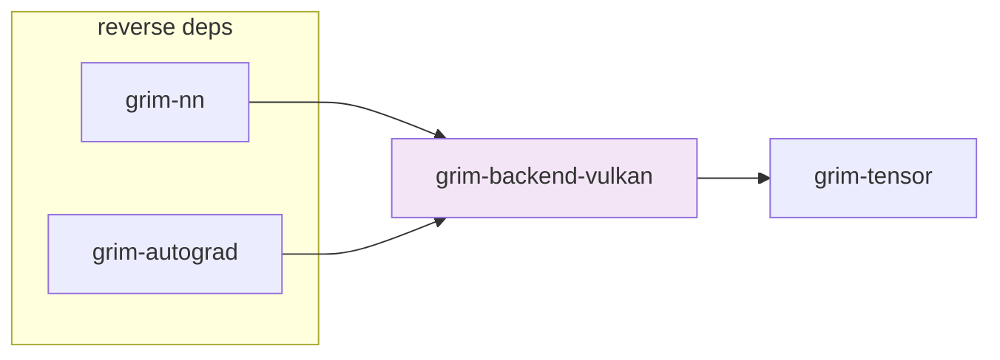

# grim-backend-vulkan

Vulkan compute backend for Grim — implements `BackendDevice` and `BackendStorage` traits from `grim-tensor` via Vulkan compute shaders.

## Purpose

Provides `VulkanDevice` and `VulkanStorage` as a cross-platform GPU backend using the Vulkan compute pipeline. Exposes a fused QKV attention compute shader dispatch.

## Boundaries

- Does **not** define the `BackendDevice` / `BackendStorage` traits — those are declared in `grim-tensor`.
- Does **not** provide the full ROCm backend feature set (no RCCL, no HIP graph capture, no MIOpen).
- Does **not** handle model loading — see `grim-format`.

## Dependency Graph



## Public API

```rust
pub struct VulkanDevice;
pub struct VulkanStorage { /* Vulkan buffer handle + metadata */ }

impl VulkanDevice {
    pub fn new() -> Self;
    pub fn probe() -> Result<Vec<VulkanDevice>>;
    pub fn qkv_attention_inner(&self, q: &dyn BackendStorage,
        k: &dyn BackendStorage, v: &dyn BackendStorage,
        out: &mut dyn BackendStorage,
        scale: f32, stride_q: usize, stride_k: usize, stride_v: usize,
        stride_out: usize, batch: usize, heads: usize, seq_len: usize,
        head_dim: usize, block_tables: Option<&[u32]>,
        max_seq_len: usize, alibi: Option<&[f32]>) -> Result<()>;
}

impl Default for VulkanDevice {
    fn default() -> Self { Self::new() }
}

impl BackendDevice for VulkanDevice { /* ... */ }
```

Vulkan FFI constants and types:

```rust
pub type VkFlags = u32;
pub type VkDeviceSize = u64;
pub const VK_STRUCTURE_TYPE_INSTANCE_CREATE_INFO: u32 = 1;
// ... plus Vulkan structure type and physical device type constants
```

## Feature Flags

This crate has no feature flags.

## Edge Cases, Limitations, and Quirks

- `VulkanDevice` is a zero-sized type — a `LazyLock` holds the global Vulkan context; if initialization fails, `probe()` returns an empty vector.
- The fused QKV attention shader is the primary optimization; non-attention ops dispatch through the generic `BackendDevice` path.
