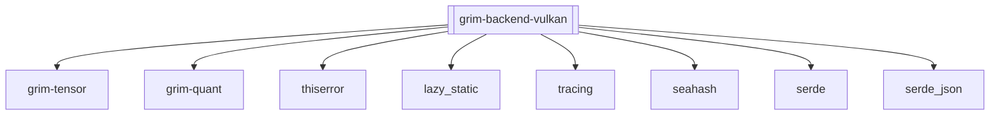

## Purpose
The `grim-backend-vulkan` crate provides a highly portable backend for the Grim engine using the Vulkan graphics and compute API. It ensures that inference can run on virtually any modern hardware platform (AMD, NVIDIA, Intel, and mobile SOCs) that supports Vulkan compute shaders.

## Boundaries
This crate connects the Grim engine to Vulkan 1.x APIs. It explicitly targets compute capabilities and storage buffers, ignoring Vulkan's graphics pipeline (rasterization, presentation). It operates via standard Vulkan FFI and requires a valid Vulkan ICD (Installable Client Driver) on the host system.

## Dependency Graph


## Public API Overview
- `VulkanDevice` / `VulkanContext`: Initializes the Vulkan instance, physical device, logical device, and compute queues.
- `VulkanStorage`: Wraps `VkBuffer` and `VkDeviceMemory` for hardware-accessible tensor data.
- `VulkanHandle`: Represents execution synchronization (often synchronous `vkQueueWaitIdle` in current implementation).
- `VulkanAutotuner`: Profiles kernel workgroup configurations to achieve optimal utilization across diverse hardware architectures.

## Usage Example
```rust
use grim_backend_vulkan::caps::VulkanCaps;

fn print_vulkan_caps(caps: &VulkanCaps) {
    println!("Vulkan Device: {}", caps.device_name);
    println!("Compute Queue Family: {}", caps.queue_family_index);
}
```

## Use Cases
- Hardware-agnostic execution where proprietary drivers (CUDA, ROCm) are unavailable or difficult to configure.
- Edge device or consumer desktop deployment targeting integrated graphics or generic hardware.

## Edge Cases, Limitations, and Quirks
- The initialization routine deliberately rejects software rasterizers (like `lavapipe` or `swiftshader`) to prevent severe performance penalties when actual hardware acceleration is expected.
- Memory allocation maps host-visible and host-coherent buffers whenever possible to simplify data upload, which might incur overhead compared to purely device-local staging strategies.

## Build Flags, Feature Flags, and Environment Variables
- `default`: No default features are enabled.
