# grim-cli

## Purpose
The `grim-cli` crate is the main entry point and command-line interface for the Grim framework. It provides a comprehensive suite of subcommands to interact with the engine, ranging from serving the HTTP API and running one-shot generation tasks, to managing the local model catalog, executing benchmarks, running evolutionary quantization (Oxidizer), and compiling plugins. 

## Boundaries
As a CLI application, this crate is primarily responsible for argument parsing (`clap`), orchestrating commands, reading user environment variables, and wiring together the core library crates (`grim-engine`, `grim-server`, `grim-quant`, etc.). It does not contain foundational inference logic itself; instead, it configures and invokes the appropriate modules based on the requested subcommand.

## Dependency Graph

```mermaid
graph TD
    %% Focal Node
    grim-cli(("grim-cli"))

    %% Workspace Dependencies
    grim-cli --> grim-tensor
    grim-cli --> grim-tensor-graph
    grim-cli --> grim-core
    grim-cli --> grim-engine
    grim-cli --> grim-server
    grim-cli --> grim-disagg
    grim-cli --> grim-memory
    grim-cli --> grim-models-transformer
    grim-cli --> grim-models-mamba
    grim-cli --> grim-backend-cpu
    grim-cli --> grim-backend-rocm
    grim-cli --> grim-backend-cuda
    grim-cli --> grim-backend-vulkan
    grim-cli --> grim-backend-metal
    grim-cli --> grim-speculative
    grim-cli --> grim-plugin
    grim-cli --> grim-format
    grim-cli --> grim-quant
    grim-cli --> grim-nn
    grim-cli --> grim-autograd
    grim-cli --> rand

    %% External Dependencies
    grim-cli -.-> clap
    grim-cli -.-> tokio
    grim-cli -.-> windows-service
    grim-cli -.-> serde
    grim-cli -.-> serde_json
    grim-cli -.-> rcgen
    grim-cli -.-> reqwest
    grim-cli -.-> sha2
    grim-cli -.-> zstd
    grim-cli -.-> chrono
```


## Public API Overview
The "Public API" of this crate is its CLI surface area. Major subcommands include:
- **`serve`**: Bootstraps the `grim-server` to expose the OpenAI-compatible REST API. Supports binding address configuration and Disaggregation routing parameters.
- **`run`**: Execute a one-shot prompt inference or interactive session directly in the terminal.
- **`pull` / `dl`**: Download models from Hugging Face or Ollama registries into the local catalog.
- **`oxidize` / `convert`**: Invoke the Oxidizer pipeline (calibrate, EvoPress search, package) to convert standard weights into ROCm-optimized `.grim` files.
- **`train`**: Fine-tune LoRA adapters (QLoRA) against local datasets using various optimizers (AdamW, Lion, GaLore, etc.).
- **`bench`**: Run throughput benchmarks (tokens/sec) and smoke tests.
- **`doctor`**: Verifies system dependencies, GPUs, and installation health.
- **`service`**: Install and manage a background OS daemon (via `windows-service` or systemd equivalents).
- **`plugin`**: Compile, validate, and load external WASM or dynamic plugins.

## Usage Example
```bash
# Download a model from Hugging Face
grim pull hf.co/meta-llama/Llama-3.2-1B-Instruct

# Run the inference server on port 11434
grim serve --port 11434

# Convert a GGUF model to a ROCm-optimized .grim file
grim convert -i model.gguf -o model.grim --target gfx1100 --target-bpw 4.0
```

## Use Cases
- The primary binary distributed to users to operate the Grim stack.
- Automating model lifecycle (download, convert, merge adapters) via shell scripts.
- Serving as the daemon entry point for long-running infrastructure deployments.
- Bootstrapping complex multi-GPU tensor-parallel runs via CLI arguments rather than hardcoded configurations.

## Edge Cases, Limitations, and Quirks
- **Unsafe Env Var Manipulation**: When `grim run --device <dev>` is used, the CLI alters the `GRIM_BACKEND` environment variable using `unsafe { std::env::set_var }`. This is safe only because it happens before any engine tasks or threads are spawned, but highlights a strict boot-order dependency.
- **Local Catalog Override**: If a user runs a model name that matches a known remote schema (like `hf/meta-llama`), but that exact name exists in the local catalog cache, the local model is chosen to prevent permanent un-routability of cached models.

## Build Flags, Feature Flags, and Environment Variables
- **Features**: 
  - `default = ["rocm"]` (Optimizes for AMD architectures by default).
  - `rocm`: Enables `grim-backend-rocm/cubecl` integration.
  - `wasm-sandbox`: Enables `grim-plugin/wasm-sandbox` for safe plugin execution.
- **Environment Variables**:
  - `GRIM_HOST` / `GRIM_PORT`: Default bind settings for `serve`.
  - `GRIM_BACKEND`: Target backend (cuda, rocm, metal, vulkan, cpu).
  - `GRIM_TP_SIZE` / `GRIM_TP_RANK`: Tensor Parallel configuration context passed down into `grim-engine`.
