# `grim-cli`

`grim-cli` is the primary executable binary and command-line interface for the Grim framework. It exposes commands for serving OpenAI- and Ollama-compatible APIs, one-shot and interactive inference, model downloads, hardware pre-flight diagnostics, model conversion and quantization, benchmarking, and adapter fine-tuning.

## Boundaries

`grim-cli` does **not**:
- Implement neural network forward or backward passes directly (delegated to `grim-models-*`, `grim-autograd`, and `grim-engine`).
- Execute raw GPU shaders or manage low-level driver contexts directly (delegated to `grim-backend-*`).
- Contain custom tensor storage allocators (delegated to `grim-tensor` and `grim-memory`).

## Dependency Graph

```mermaid
%%{init: {'theme': 'base', 'themeVariables': { 'primaryColor': '#2b2d42', 'edgeLabelBackground':'#ffffff', 'tertiaryColor': '#edf2f4'}}}%%
flowchart TD
    subgraph Sibling Dependents
        User["User / Shell / Systemd"]
    end

    subgraph Focal Node
        grim_cli["grim-cli"]
    end

    subgraph Workspace Dependencies
        grim_engine["grim-engine"]
        grim_server["grim-server"]
        grim_autograd["grim-autograd"]
        grim_format["grim-format"]
        grim_quant["grim-quant"]
        grim_memory["grim-memory"]
        grim_disagg["grim-disagg"]
        grim_backend_rocm["grim-backend-rocm"]
        grim_backend_cuda["grim-backend-cuda"]
        grim_backend_vulkan["grim-backend-vulkan"]
        grim_backend_metal["grim-backend-metal"]
        grim_backend_cpu["grim-backend-cpu"]
        grim_core["grim-core"]
        grim_tensor["grim-tensor"]
    end

    subgraph External Dependencies
        clap["clap"]
        tokio["tokio"]
        serde_json["serde_json"]
    end

    User -->|executes binary| grim_cli

    grim_cli --> grim_engine
    grim_cli --> grim_server
    grim_cli --> grim_autograd
    grim_cli --> grim_format
    grim_cli --> grim_quant
    grim_cli --> grim_memory
    grim_cli --> grim_disagg
    grim_cli --> grim_backend_rocm
    grim_cli --> grim_backend_cuda
    grim_cli --> grim_backend_vulkan
    grim_cli --> grim_backend_metal
    grim_cli --> grim_backend_cpu
    grim_cli --> grim_core
    grim_cli --> grim_tensor
    grim_cli --> clap
    grim_cli --> tokio
    grim_cli --> serde_json

    classDef focal fill:#d90429,stroke:#ef233c,stroke-width:2px,color:#ffffff;
    classDef workspace fill:#2b2d42,stroke:#8d99ae,stroke-width:1px,color:#edf2f4;
    classDef sibling fill:#4a4e69,stroke:#9a8c98,stroke-width:1px,color:#f2e9e4;
    classDef external fill:#1f2421,stroke:#495867,stroke-width:1px,color:#f0f3f4;

    class grim_cli focal;
    class grim_engine,grim_server,grim_autograd,grim_format,grim_quant,grim_memory,grim_disagg,grim_backend_rocm,grim_backend_cuda,grim_backend_vulkan,grim_backend_metal,grim_backend_cpu,grim_core,grim_tensor workspace;
    class User sibling;
    class clap,tokio,serde_json external;
```



## Public API Overview

`grim-cli` produces the `grim-cli` binary (conventionally installed as `grim`; see `docs/howto/install-grim.md`). Subcommands include:

- **`serve`**: Bootstraps the HTTP server with OpenAI- and Ollama-compatible endpoints. `--model <name-or-path>` optionally preloads a model at startup.
- **`run`**: Runs a single prompt or interactive REPL session from the command line (`--serve` starts the HTTP server with the model preloaded). Interactive multi-turn chat lives here and in the `tui` diagnostics interface — there is no separate `chat` subcommand.
- **`pull` / `dl`**: Downloads model checkpoints from Hugging Face or Ollama registries.
- **`convert`**: One-shot conversion of GGUF, GGML, SafeTensors, or PyTorch weights into optimized `.grim` files. Quantization is part of conversion (`--target-bpw`); there is no separate `quantize` subcommand.
- **`oxidizer`**: Full evolutionary conversion pipeline (`grim oxidizer convert` runs calibrate → search → write).
- **`doctor`**: Diagnostic tool checking hardware drivers, VRAM fit (`--model`), and ROCm/CUDA/Vulkan availability.
- **`train`**: Fine-tunes adapters (`--mode qlora|lora|full-bf16|full-fp16|soul-eater|oft`) with optional PiSSA init, OLoRA penalty, LoRA+ ratios, held-out `--eval-dataset`, and deterministic `--seed`.
- **`merge`**: Bakes a trained adapter sidecar permanently into a base `.grim` model file (adapter export).
- **`bench`**: Measures token generation speed with configurable `--tokens` and `--concurrency`.
- **`templates`**: `list` / `inspect` / `render` chat template families (e.g. `grim templates inspect chatml`).
- **`verify` / `provenance`**: Inspect `.grim` file structure and compression (`verify`); verify model integrity, checksums, and catalog provenance (`provenance`).
- Run `grim --help` for the full list (`tui`, `garage`, `tune`, `scheduler`, `spec`, `plugin`, `arch-plugin`, `service`, `rm`, `cp`, `stop`, `ps`, `list`, `status`, `check`, `show`, `use`, `login`, `start`, `reap`, `multimodal`).

## Usage Example

```bash
# 1. Inspect hardware environment and model fit
grim doctor --model models/llama-3.2-1b.gguf

# 2. Pull a model, then start the inference server on port 8080
#    (serve also accepts --model <name-or-path> to preload at startup)
grim pull llama3
grim serve --port 8080

# 3. Chat over the OpenAI-compatible API; the model is named per request
curl http://127.0.0.1:8080/v1/chat/completions \
  -H 'content-type: application/json' \
  -d '{"model":"llama3","messages":[{"role":"user","content":"Hello, world!"}]}'

# 4. Train a LoRA adapter with deterministic seed
grim train \
  --model models/llama-3.2-1b.gguf \
  --dataset data/train.jsonl \
  --output adapters/my-lora.grim.train \
  --seed 42 \
  --lr 1e-4 \
  --epochs 3
```

## Use Cases

- Standalone deployment binary for local and production inference serving.
- Hardware qualification and VRAM pre-flight verification on edge and datacenter systems.
- Scriptable pipeline integration for model conversion, calibration, and fine-tuning.

## Edge Cases, Limitations, and Quirks

1. **Pre-flight Device Selection**: Setting `--device <backend>` configures the global target backend before engine initialization.
2. **Deterministic PRNG**: Supplying `--seed <u64>` to `grim train` initializes reproducible adapter weight distributions across CPU and ROCm/CUDA backends.
3. **Local Catalog Resolution**: Model names matching local files in the current working directory or `models/` take precedence over remote registry downloads.

## Build Flags, Feature Flags, and Environment Variables

- `default = ["rocm"]`: ROCm GPU backend enabled by default (via `grim-backend-rocm/cubecl`).
- `rocm`: Enables the ROCm backend via `cubecl`.
- `cuda`: Enables NVIDIA CUDA compilation.
- `wasm-sandbox`: Enables the WASM plugin sandbox in `grim-plugin`.
- **Environment variables**: `GRIM_HOST`, `GRIM_PORT`, `GRIM_BACKEND`, `GRIM_CONFIG_PATH`, `GRIM_LOG_DIR`.
