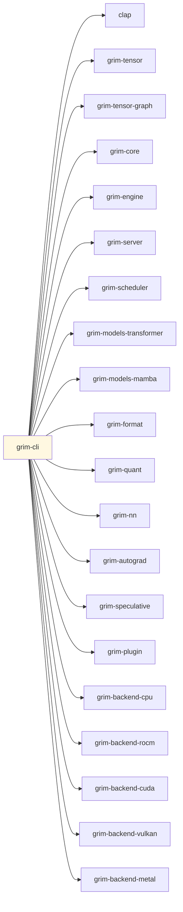

# grim-cli

Grim CLI — run, bench, convert, train, manage plugins and services.

## Purpose

Command-line interface for Grim:
- Model serving (`serve`)
- One-shot inference (`run`)
- Benchmarking (`bench`)
- Model conversion to `.grim` format (`convert`)
- Training / fine-tuning LoRA adapters (`train`)
- Speculative decoding draft training (`spec train`)
- ROCm-optimized format conversion (`oxidizer`)
- Plugin management (`plugin`, `accept`, `compat`)
- Service management (`service`)
- Model catalog management (`dl`, `pull`, `rm`, `stop`, `ps`, `list`, `check`, `show`)
- Client integrations (`start`, `reap`)
- Installation self-check (`doctor`)
- File verification (`verify`)

## Boundaries

- Does not perform inference itself — delegates to `grim-engine` and `grim-server`.
- Does not define backends — calls into runtime crates.
- Does not define models — calls into `grim-models-*` crates.
- All subcommands are entry points in a single binary (`grim-cli`).

## Dependency Graph



## Subcommands

### Core Commands

```bash
grim serve [OPTIONS]                     # Start HTTP server (Ollama-compatible, default 127.0.0.1:11434)
grim run [MODEL] [OPTIONS]               # One-shot inference or interactive chat
grim bench [OPTIONS]                     # Benchmark / smoke test
grim dl MODEL [OPTIONS]                  # Download model from HF or Ollama
grim pull MODEL [OPTIONS]                # Alias for dl
grim convert [OPTIONS]                   # Convert model to ROCm-optimized .grim format
grim train [OPTIONS]                     # Fine-tune LoRA adapters (QLoRA)
grim stop MODEL                          # Stop a running model (unload from memory)
grim rm MODEL                            # Delete model from local cache
grim status                              # Show loaded models, memory usage, backend
grim ps                                  # Alias for status
grim check                               # Check local model cache
grim list                                # Alias for check
grim show [OPTIONS]                      # Show available models organized by format
grim quantize                            # Quantize model (stub)
```

### Service Commands

```bash
grim service install [OPTIONS]           # Install platform-native background daemon
grim service uninstall [OPTIONS]         # Uninstall daemon
grim service start [OPTIONS]             # Start daemon
grim service stop [OPTIONS]              # Stop daemon
grim service status [OPTIONS]            # Query daemon status
grim service run [OPTIONS]               # Run service process (invoked by SCM)
```

### Plugin Commands

```bash
grim plugin list                         # List loaded plugins
grim plugin load [OPTIONS] [PATH]        # Load plugins from directory
grim accept PLUGIN_PATH                  # Install model architecture plugin
grim compat CONFIG_PATH [OPTIONS]        # Generate .grimplugin from HF config.json
```

### Speculative Commands

```bash
grim spec train [OPTIONS]                # Distill / train a draft model for speculative decoding
```

### Oxidizer Commands (ROCm conversion)

```bash
grim oxidizer info PATH                  # Show GGUF/.grim metadata
grim oxidizer calibrate [OPTIONS]        # Run importance matrix calibration
grim oxidizer search [OPTIONS]           # Run EvoPress evolutionary search
grim oxidizer convert [OPTIONS]          # Full convert pipeline: calibrate → search → write .grim
grim oxidizer raven [OPTIONS]            # FP8/MXFP4 repack pipeline
grim oxidizer prepare [OPTIONS]          # Prepare training-capable .grim artifact
grim oxidizer fuse [OPTIONS]             # Analyze and bake fusion hints
```

### Utility Commands

```bash
grim doctor [OPTIONS]                    # Verify installation (§13.5)
grim cp SRC DST                          # Copy model in local cache
grim login PROVIDER [OPTIONS]            # Log in to registry or cloud provider
grim use CONTEXT MODEL                   # Set default model for a client context
grim start CLIENT [MODEL] [args]         # Start a client integration (hermes, openclaw, etc.)
grim reap CLIENT [options]               # Launch external app with grim-tracked model
grim verify [OPTIONS]                    # Verify a .grim file (structure, compression, QLoRA)
```

### Client Integrations (`grim start` / `grim reap`)

The `ClientIntegration` enum supports: `hermes`, `openclaw`, `claw` (Claude Code), `codex`, `antigravity`, `zcode`.

## Usage Example

```bash
# Start server
grim serve --host 127.0.0.1 --port 8080

# Run inference
grim run llama3 --prompt "Hello, world!" --max-tokens 128

# Benchmark
grim bench --tokens 256 --concurrency 4

# Download model
grim pull granite-3.1-8b

# Stop loaded model
grim stop llama3

# Convert to ROCm-optimized format
grim convert --input model.gguf --output model.grim --target auto

# Self-check
grim doctor --addr 127.0.0.1:11434
```

## Feature Flags

| Flag | Default | Description |
|---|---|---|
| `rocm` | yes | Enable ROCm backend (default) |
| `wasm-sandbox` | - | Enable WASM plugin sandboxing |

## Edge Cases, Limitations, and Quirks

- **ROCm profile**: `--rocml-profile` option on `dl`/`pull`/`convert` suggests ROCm-tuned conversion after download. The suggestion is opt-in and never auto-executed.
- **`quantize` stub**: `grim quantize` has no arguments — it is a placeholder for future quantization workflow.
- **Service management**: Uses platform-native service managers (systemd on Linux, Windows SCM on Windows). `service run` is invoked by the SCM, not users directly.
- **`reap`**: Launches an external client app with a grim-tracked model baked in. Uses `--` argument separator for extra args.
- **`doctor`**: Checks unit on disk, OS service visibility, HTTP health, GPU backend, WASM grant enforcement, and ExecStart consistency (§13.5).
