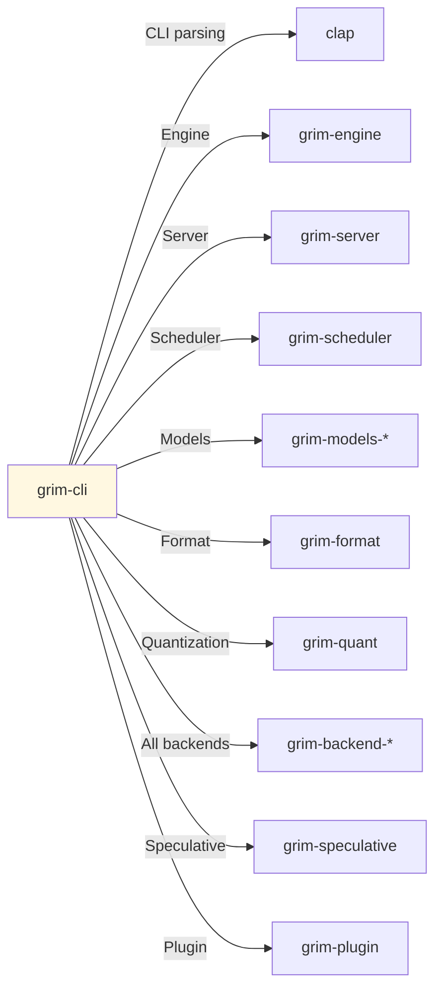

# grim-cli

Grim CLI — run, bench, quantize, plugin management.

## Purpose

Command-line interface for Grim:
- Model serving (`serve`)
- One-shot inference (`run`)
- Benchmarking (`bench`)
- Model conversion (`convert`)
- Training (`train`)
- Plugin management (`plugin`)
- Service management (`service`)
- Model catalog management (`list`, `check`, `pull`, etc.)

## Boundaries

- Does not perform inference — delegates to engine
- Does not define backends — calls into runtime crates
- All subcommands are separate entry points

## Dependency Graph



## Subcommands

### Core Commands

```bash
grim serve [OPTIONS]                    # Start HTTP server
grim run [MODEL] [OPTIONS]           # One-shot inference
grim bench [OPTIONS]                 # Benchmark smoke test
grim dl MODEL [OPTIONS]              # Download model
grim pull MODEL [OPTIONS]            # Alias for dl
grim quantize                        # Quantize model (stub)
grim convert [OPTIONS]               # Convert to .grim format
grim train [OPTIONS]                 # Fine-tune LoRA adapters
grim stop MODEL                      # Stop loaded model
grim rm MODEL                        # Delete model from cache
grim status                          # Show loaded models
grim ps                              # Alias for status
grim check                           # Check model cache
grim list                            # List cached models
grim show [OPTIONS]                  # Show available models
```

### Service Commands

```bash
grim service install [OPTIONS]       # Install background daemon
grim service uninstall [OPTIONS]     # Uninstall daemon
grim service start [OPTIONS]       # Start daemon
grim service stop [OPTIONS]        # Stop daemon
grim service status [OPTIONS]      # Check daemon status
grim service run [OPTIONS]         # Run as service (Windows SCM)
```

### Plugin Commands

```bash
grim plugin list                   # List loaded plugins
grim plugin load [OPTIONS] [PATH]  # Load plugins from directory
grim accept PLUGIN_PATH            # Install model architecture plugin
grim compat CONFIG_PATH [OPTIONS]  # Generate .grimplugin from HuggingFace config
```

### Speculative Commands

```bash
grim spec train [OPTIONS]          # Train a draft model for speculative decoding
```

### Oxidizer Commands (ROCm conversion)

```bash
grim oxidizer info PATH            # Show GGUF/.grim metadata
grim oxidizer calibrate [OPTIONS]  # Run importance matrix calibration
grim oxidizer search [OPTIONS]     # Run EvoPress evolution
grim oxidizer convert [OPTIONS]    # Full convert pipeline
grim oxidizer raven [OPTIONS]      # FP8 repack pipeline
grim oxidizer prepare [OPTIONS]    # Prepare training artifact
grim oxidizer fuse [OPTIONS]       # Analyze and bake fusion hints
```

### Utility Commands

```bash
grim doctor [OPTIONS]              # Verify installation
grim cp SRC DST                    # Copy model
grim login PROVIDER [OPTIONS]      # Login to registry
grim use CONTEXT MODEL             # Set default model for context
```

## Usage Example

```bash
# Start server
grim serve --address 127.0.0.1:8080

# Run inference
grim run llama3 --prompt "Hello, world!" --max-tokens 128

# Benchmark
grim bench --tokens 256 --concurrency 4

# Download model
grim pull granite-3.1-8b

# Stop server
grim stop llama3
```

## Feature Flags

| Flag | Default | Description |
|---|---|---|
| rocm | yes | Enable ROCm backend (default) |
| wasm-sandbox | - | Enable WASM plugin sandboxing |

## Edge Cases

1. **ROCm profile**: `--rocml-profile` option for GPU-targeted conversions
2. **ROCM conversion suggestion**: After `grim pull`, suggests ROCm-tuned conversion
3. **Client integrations**: `grim start` supports hermes, openclaw, claude-code, codex, antigravity, zcode