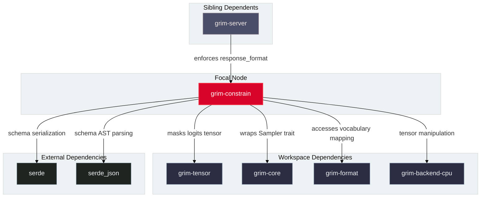

# `grim-constrain`

`grim-constrain` provides structured and grammar-constrained decoding for language model generation in Grim. It implements finite-state-machine (FSM) token maskers and JSON Schema validators that wrap any `grim_core::sampler::Sampler` to guarantee that output token sequences conform to valid JSON syntax or specific JSON Schema definitions.

## Boundaries

`grim-constrain` does **not**:
- Perform model forward passes or compute logits (delegated to model crates and backend crates).
- Implement baseline sampling strategies like greedy, top-k, top-p, min-p, or temperature (delegated to `grim-core::sampler`).
- Parse HTTP requests or manage client connections (delegated to `grim-server`).
- Depend on external C/C++ grammar runtimes or Python bridges.

## Dependency Graph



## Public API Overview

Exposed from `src/lib.rs`:

### Structs and Enums

```rust
/// Constraint mode enforced by a ConstrainedSampler.
#[derive(Debug, Clone)]
pub enum Constraint {
    /// response_format: {"type": "json_object"}
    JsonObject,
    /// response_format: {"type": "json_schema", "json_schema": {...}}
    JsonSchema(JsonSchemaConstraint),
}

impl Constraint {
    pub fn json_object() -> Self;
    pub fn json_schema(schema: serde_json::Value) -> Result<Self, JsonSchemaCompilerError>;
}

/// Sampler wrapping an inner Sampler to constrain outputs to an FSM path.
pub struct ConstrainedSampler {
    // inner: Arc<dyn Sampler>
    // fsm: Arc<Mutex<Box<dyn DynamicFsm>>>
}

impl ConstrainedSampler {
    pub fn new(
        inner: std::sync::Arc<dyn grim_core::sampler::Sampler>,
        constraint: Constraint,
        vocab: std::sync::Arc<[String]>,
    ) -> Self;

    pub fn accept(&self, token: u32);
    pub fn state(&self) -> JsonModeState;
    pub fn is_terminal(&self) -> bool;
}

impl grim_core::sampler::Sampler for ConstrainedSampler {
    fn sample(&mut self, logits: &grim_tensor::Tensor) -> grim_tensor::error::Result<u32>;
}

/// Helper constructor to build a JSON-object constrained sampler.
pub fn constrained_json_object(
    inner: std::sync::Arc<dyn grim_core::sampler::Sampler>,
    vocab: std::sync::Arc<[String]>,
) -> ConstrainedSampler;

/// State machine tracking valid syntactic JSON prefixes.
#[derive(Debug, Clone, Copy, PartialEq, Eq, Hash)]
pub enum JsonModeState {
    Start,
    InObjectKey,
    AfterObjectKey,
    InObjectValue,
    AfterObjectValue,
    InArrayValue,
    AfterArrayValue,
    InString,
    InEscape,
    InNumber,
    InKeyword(u8),
    Terminal,
    Error,
}

/// Finite-state machine for JSON grammar validation.
#[derive(Debug, Clone)]
pub struct JsonModeFsm {
    pub state: JsonModeState,
}

impl JsonModeFsm {
    pub fn new() -> Self;
    pub fn transition(&mut self, ch: char);
    pub fn allows(&self, token_str: &str) -> bool;
}

/// Error produced when JSON schema parsing or AST compilation fails.
#[derive(Debug, thiserror::Error)]
pub enum JsonSchemaCompilerError {
    #[error("unsupported schema type: {0}")]
    UnsupportedType(String),
    #[error("missing required schema field: {0}")]
    MissingField(String),
    #[error("malformed schema AST: {0}")]
    MalformedSchema(String),
}
```

## Usage Example

```rust
use std::sync::Arc;
use grim_core::sampler::{GreedySampler, Sampler};
use grim_constrain::{constrained_json_object, Constraint, ConstrainedSampler};

// 1. Vocabulary list representing token strings for token IDs 0..N
let vocab: Arc<[String]> = Arc::new([
    "{\"".into(),
    "name\":".into(),
    " \"Grim\"".into(),
    "}".into(),
    "hello".into(),
]);

// 2. Wrap a standard GreedySampler
let inner = Arc::new(GreedySampler);
let mut sampler = constrained_json_object(inner, vocab);

// 3. Sampling logits will mask out invalid tokens (such as "hello" when '{' is expected)
// let token = sampler.sample(&logits).expect("sample within valid FSM transitions");
```

## Use Cases

1. **OpenAI-Compatible `response_format`**: `grim-server` handles `response_format = {"type": "json_object"}` and `{"type": "json_schema", ...}` by wrapping the request session sampler with `ConstrainedSampler`.
2. **Deterministic Structured Extraction**: Guarantees that agent tool calls or structured schema responses parse without syntax errors.

## Edge Cases, Limitations, and Quirks

1. **State Lock Contention**: `ConstrainedSampler` stores FSM state inside `Arc<Mutex<...>>` to satisfy `Send + Sync` constraints across asynchronous Tokio tasks. The lock is held exclusively during token mask evaluation and released prior to invoking the inner sampler.
2. **Multi-byte UTF-8 Boundaries**: The token masking FSM evaluates individual UTF-8 fragments. Tokens splitting mid-codepoint fall back to non-matching unless the partial buffer matches valid JSON state prefixes.
3. **Logit Clamping**: Disallowed tokens are masked by setting their logit values to `f32::NEG_INFINITY`. If all tokens in the vocabulary are disallowed by an invalid state transition, greedy sampling returns error `TensorError`.

## Build Flags, Feature Flags, and Environment Variables

- **Default features**: None.
- **Dependencies**: Pure Rust without external native library dependencies.
