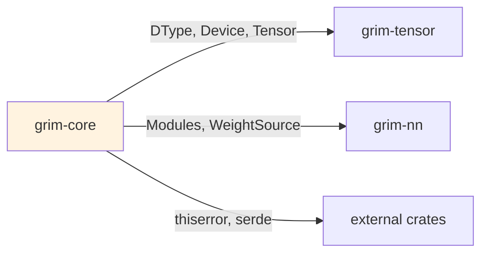

# grim-core

Model trait family, Session, KV cache, sampler, error types — pure abstractions over grim-tensor and grim-nn.

## Purpose

Provides the core abstractions for model orchestration: the `Model` trait family, `Session` for per-request state, `KvCache` trait for autoregressive generation, `Sampler` for token selection, and error types. This crate is backend-agnostic.

## Boundaries

- Does not perform tensor computations — delegates to backends
- Does not define specific model architectures — see `grim-models-*`
- Does not manage memory allocation — see `grim-memory`
- Does not spawn HTTP servers — see `grim-server`

## Dependency Graph



## Public API

### Model Traits

```rust
pub trait Model {
    fn device(&self) -> Device;
    fn forward(&mut self, positions: &[u32], input_ids: &[u32], 
               past: Option<&KvCache>, adapters: &[AdapterHandle]) -> Result<Logits>;
}

pub trait CausalLm: Model {
    fn load(&mut self, src: &mut impl TensorProvider, 
            progress: Option<&dyn Fn(f32)>) -> Result<()>;
}

pub trait DiffusionModel: Model {
    fn load(&mut self, weights: &mut impl TensorProvider) -> Result<()>;
}

pub trait Encoder: Model {
    fn encode(&mut self, input_ids: &[u32], positions: &[u32]) -> Result<Tensor>;
}
```

### Session and Determinism

```rust
pub struct Session { /* private fields */ }

impl Session {
    pub fn new(model: &dyn Model) -> Self;
    pub fn step(&mut self) -> Result<()>;
    pub fn current_pos(&self) -> usize;
    pub fn advance_pos(&mut self, n: usize);
}

pub enum DeterminismMode { Relaxed, Strict }
```

### KvCache Trait

```rust
pub trait KvCache {
    fn append(&mut self, layer: usize, head: usize, 
              k: &[f32], v: &[f32]) -> Result<()>;
    fn get(&self, layer: usize, head: usize) -> Result<Option<&[f32]>>;
}
```

### Sampler

```rust
pub struct SamplingParams {
    pub temperature: f32,
    pub top_p: f32,
    pub top_k: u32,
    pub repeat_penalty: f32,
}

pub trait Sampler {
    fn sample(&self, logits: &[f32], _state: &mut impl std::any::Any) -> u32;
}
```

### Error Types

```rust
pub enum Error {
    Tensor(TensorError),
    Config(String),
    Session(String),
    KvCache(String),
    Sampler(String),
    Shape(String),
    Unimplemented(String),
}
pub type Result<T> = std::result::Result<T, Error>;
```

### Path Resolution

```rust
pub fn grim_models_dir() -> PathBuf;
pub fn grim_config_dir() -> PathBuf;
pub fn grim_log_dir() -> PathBuf;
pub fn grim_plugins_dir() -> PathBuf;
pub fn home_dir() -> Option<PathBuf>;
```

## Usage Example

```rust
use grim_core::{Model, Session, Sampler, DeterminismMode};

let session = Session::new(&model);
let sampler = SamplingParams::default().into_sampler(42);

let token = sampler.sample(&logits, &mut ());
session.advance_pos(1);
```

## Feature Flags

This crate has no feature flags.

## Edge Cases

1. **DeterminismMode::Strict**: Requires pre-allocated RNG state; slower but reproducible
2. **KvCache implementations**: Different backends provide specialized implementations
3. **Model loading**: `load()` implementations vary by architecture type