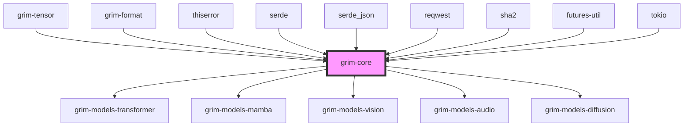

# grim-core

## Purpose
Provides the core abstractions for Grim, including the `Model` trait family, `Session` state, KV cache management, sampling pipelines, and error types. It acts as the pure abstraction layer over `grim-tensor` and `grim-nn`.

## Boundaries
- Defines traits and generic structures (e.g., `CausalLm`, `StatefulSequence`).
- Does not implement specific model architectures.
- Does not implement backend-specific tensor operations.
- Handles model cataloging, remote downloading, and environment configuration.

## Dependency Graph


## Public API Overview
- **Model Traits:** `Model`, `CausalLm`, `DiffusionModel`, `Encoder`, `EncoderDecoderLm`, `StatefulSequence`.
- **State & Memory:** `Session`, `KvCache`, `SsmState`.
- **Configuration & Setup:** `ModelConfig`, `ModelArchitecture`, `RuntimeEnv`, `Backend`.
- **Utilities:** `DownloadProgress`, `Sampler`, `Error`, `TensorError`.

## Usage Example
```rust
use grim_core::{CausalLm, ModelConfig, ModalityHint};
use grim_core::session::Session;

// Trait usage example
// let logits = model.forward(&mut session, &input_ids, &positions, &adapters)?;
```

## Use Cases
- Establishing the standard interfaces that all `grim-models` must implement.
- Abstracting KV cache allocation and session lifecycle from model implementations.

## Edge Cases, Limitations, and Quirks
- The KV cache layout and requirements are delegated to the implementations but orchestrated via `Session` and `KvCache`.
- Downloading and catalog paths use hardcoded strategies relative to `home_dir`.

## Build Flags, Feature Flags, and Environment Variables
- Relies on `reqwest` features like `json` and `stream`.
- Relies on `tokio` features like `rt` and `sync`.
- Does not define custom feature flags.
