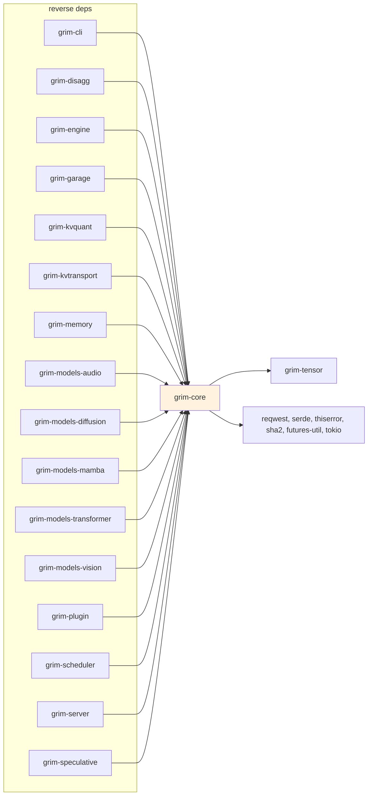

# grim-core

Model trait family, `Session` for per-request state, `KvCache` trait for autoregressive generation, `Sampler` for token selection, error types, and shared utilities. Backend-agnostic — depends only on `grim-tensor` and external crates (`thiserror`, `serde`, `reqwest`, `sha2`, `futures-util`, `tokio`).

## Purpose

Provides the core abstractions that model implementations and the engine rely on: the `Model` trait family (`CausalLm`, `DiffusionModel`, `Encoder`), `Session` for per-request execution state, `KvCache` for key/value cache management, `Sampler` for token selection, `DeterminismMode` for reproducible inference, and `Error`/`Result` types. Also provides path resolution (`grim_models_dir`, `grim_config_dir`, etc.), model catalog listing (`list_local_models`), model downloading (`download_model`), and environment configuration (`RuntimeEnv`).

## Boundaries

- Does **not** perform tensor computations — delegates to backends via the `BackendDevice` trait.
- Does **not** define specific model architectures — see `grim-models-transformer`, `grim-models-mamba`, etc.
- Does **not** manage memory allocation or the block pool — see `grim-memory`.
- Does **not** spawn HTTP servers — see `grim-server`.
- Does **not** define training/gradient logic — see `grim-autograd`.

## Dependency Graph



## Public API

### Model Traits

```rust
pub trait Model {
    fn device(&self) -> Device;
    fn is_loaded(&self) -> bool;
}

pub trait CausalLm: Model {
    fn load(&mut self, src: &mut impl TensorProvider,
            progress: Option<&dyn Fn(f32)>) -> Result<()>;
    fn forward(&mut self, positions: &[u32], input_ids: &[u32],
               past: Option<&dyn KvCache>, adapters: &[AdapterHandle])
        -> Result<Logits>;
}

pub trait DiffusionModel: Model {
    fn load(&mut self, weights: &mut impl TensorProvider) -> Result<()>;
}

pub trait Encoder: Model {
    fn encode(&mut self, input_ids: &[u32], positions: &[u32]) -> Result<Tensor>;
}
```

Source: `src/model.rs`. The trait family defines what an inference backend must provide; concrete implementations live in `grim-models-*`.

### Session and Determinism

```rust
pub struct Session { /* private */ }

impl Session {
    pub fn new(model: &dyn Model) -> Self;
    pub fn current_pos(&self) -> usize;
    // SessionT trait methods: step, advance_pos, append_kv, rollback_kv_to, etc.
}

pub enum DeterminismMode { Relaxed, Strict }
```

Source: `src/session.rs`. `Session` manages per-request state (KV cache position, last hidden state). In `Strict` mode each request gets a deterministic RNG seeded from its request id (see `grim-engine/src/lib.rs`).

### KV Cache Trait

```rust
pub trait KvCache {
    fn len(&self) -> usize;
    fn rollback_to(&mut self, len: usize) -> Result<()>;
}
```

Source: `src/kv_cache.rs`. Backends provide concrete `KvCache` implementations (e.g., `grim-memory::PagedKvCache`).

### Sampler

```rust
pub struct SamplingParams {
    pub temperature: f32,
    pub top_p: f32,
    pub top_k: u32,
    pub repeat_penalty: f32,
}

pub trait Sampler {
    fn sample(&self, logits: &Tensor, state: &[u32]) -> Result<u32>;
}

impl IntoSampler for SamplingParams {
    fn into_sampler(self, seed: u64) -> Box<dyn Sampler>;
}
```

Source: `src/sampler.rs`. The `Sampler` trait is the extension point for custom sampling strategies (top-p, top-k, temperature, repetition penalty).

### Error Types

```rust
pub enum Error {
    Tensor(TensorError),
    Config(String),
    Session(String),
    KvCache(String),
    Sampler(String),
    Shape(String),
    Unimplemented(String),
}
pub type Result<T> = std::result::Result<T, Error>;
```

Source: `src/error.rs`. Uses `thiserror` derives. Shared across all workspace crates as the canonical error path.

### Path Resolution & Catalog

```rust
pub fn grim_models_dir() -> PathBuf;
pub fn grim_config_dir() -> PathBuf;
pub fn grim_log_dir() -> PathBuf;
pub fn grim_plugins_dir() -> PathBuf;
pub fn home_dir() -> Option<PathBuf>;

pub fn list_local_models() -> Vec<ModelEntry>;
pub fn resolve_model_path(name: &str) -> Option<PathBuf>;

pub fn download_model(url: &str, dest: &str) -> Result<()>;
pub fn download_model_with_progress(url: &str, dest: &str,
    progress: &dyn Fn(u64, u64)) -> Result<()>;
```

Source: `src/paths.rs`, `src/catalog.rs`, `src/client.rs`.

### Environment Configuration

```rust
pub enum Backend { Auto, Rocm, Cuda, Vulkan, Metal, Cpu }

pub struct RuntimeEnv {
    pub host: Option<String>,
    pub port: Option<u16>,
    pub context: Option<usize>,
    pub backend: Backend,
    pub gpus: Vec<usize>,
    pub tp_size: usize,
    pub parallel: Option<bool>,
    pub mem_budget_mib: Option<usize>,
    pub kernel_timeout: Duration,
}

impl RuntimeEnv {
    pub fn from_env() -> Self;
    pub fn resolve_bind(cli_addr: Option<&str>) -> String;
}
```

Source: `src/env_config.rs`. Reads `GRIM_*` environment variables (see Configuration Reference).

### Other Exports

```rust
pub use architecture::{ModelArchitecture, TensorNamingRegistry, TensorRole};
pub use hyperparams::{ArchHyperparameters, HyperparameterExtractor, MetadataLookup};
pub use error::{Error, Result, TensorError};
```

Source: `src/architecture.rs`, `src/hyperparams.rs`, `src/error.rs`.

## Usage Example

```rust
use grim_core::{CausalLm, Session, Sampler, SamplingParams, DeterminismMode};

// Load a model via a TensorProvider (see grim-models-transformer for a
// concrete example), then create a session:
let mut session = Session::new(&model);
let sampler = SamplingParams { temperature: 0.7, top_p: 0.9, top_k: 40,
    repeat_penalty: 1.1 }.into_sampler(42);

let token = sampler.sample(&logits, &prompt_tokens)?;
session.advance_pos(1);
```

## Feature Flags

This crate has no feature flags.

## Edge Cases, Limitations, and Quirks

- `DeterminismMode::Strict` requires a per-request seeded RNG; `Relaxed` mode is faster but non-reproducible across runs.
- `KvCache` trait methods do not enforce thread safety — implementations must be `Send` if shared across threads.
- `download_model` uses `reqwest` as a blocking call; async callers should use `tokio::task::spawn_blocking`.
- `list_local_models` scans the models directory on every call; it is not cached.
