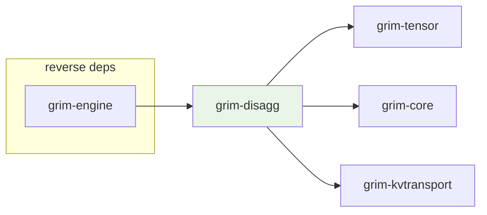

# grim-disagg

Distributed serving and disaggregation layer: enables Prefill-Decode decoupling and cross-node KV cache transport. §5.6.

## Purpose

Coordinates distributed LLM serving across separate prefill and decode pools:
- Routes prefill requests to dedicated prefill nodes
- Transfers KV cache blocks between prefill and decode nodes over the network
- Provides ReMP (2D KV-cache migration) for colocated same-VRAM-pool transfers (no network round-trip)
- Supports RDMA and TCP network transport via `NetworkKvClient`

## Boundaries

- Does not perform inference — coordinates cross-node dispatch and KV transport only.
- Does not define the `CausalLm` or `Model` traits — see `grim-core`.
- Does not manage local KV block allocation — see `grim-memory` / `grim-scheduler`.
- Does not define tensor types — depends on `grim-tensor` for dtype/device primitives.

## Dependency Graph



## Public API

### Enums

```rust
pub enum PoolRole {
    Colocated,  // Prefill and decode share one pool — ReMP applies
    Prefill,
    Decode,
}

pub enum DisaggError {
    Network(String),
    KvCache(String),
    InvalidAssignment,
    NotImplemented,
}
```

### Structs

```rust
/// Source prefill node params carried inside decode step (§5.6).
pub struct PoolAssignment {
    pub source_prefill_pool_addr: String,
    pub request_id: u64,
}

/// Single KV block: one layer, one sequence chunk.
/// Mirrors `kv_to_block_major` block-major layout.
pub struct KvBlock {
    pub data: Vec<f32>,
    pub layer_idx: u32,
    pub seq_chunk: u32,
}

/// 2D ReMP batch: outer = layers, inner = seq chunks.
/// `migrate()` drains to flat buffer in layer-major, chunk-major order.
pub struct ReMPMigrationBatch {
    pub blocks: Vec<KvBlock>,
    pub num_layers: u32,
    pub num_seq_chunks: u32,
}

pub struct DisaggRouter {
    pub prefill_node_addr: String,
    pub decode_node_addr: String,
    pub pool_role: PoolRole,
    kv_client: NetworkKvClient,
    use_rdma: bool,
}

impl DisaggRouter {
    pub fn new(prefill_node_addr: &str, decode_node_addr: &str, pool_role: PoolRole) -> Self;
    pub fn enable_rdma(&mut self, enabled: bool);
    pub fn dispatch_prefill(&self, request_id: u64, tokens: &[u32]) -> Result<()>;
    pub fn transfer_kv_cache(&self, request_id: u64, num_blocks: usize) -> Result<()>;
    pub fn dispatch_decode(
        &self,
        request_id: u64,
        last_token: u32,
        assignment: PoolAssignment,
    ) -> Result<()>;
    pub fn transfer_kv_colocated(
        &self,
        request_id: u64,
        batch: &ReMPMigrationBatch,
    ) -> Result<Vec<f32>>;
}
```

### Trait

```rust
pub trait DisaggRouterT: Send + Sync {
    fn dispatch_prefill(&self, request_id: u64, tokens: &[u32]) -> Result<()>;
    fn transfer_kv_cache(&self, request_id: u64, num_blocks: usize) -> Result<()>;
    fn dispatch_decode(
        &self,
        request_id: u64,
        last_token: u32,
        assignment: PoolAssignment,
    ) -> Result<()>;
}
```

## Usage Example

```rust
use grim_disagg::{DisaggRouter, PoolRole, PoolAssignment};

let router = DisaggRouter::new(
    "10.0.0.1:8000",  // prefill node
    "10.0.0.2:8000",  // decode node
    PoolRole::Prefill,
);

// Dispatch a prefill task to the prefill node.
router.dispatch_prefill(42, &[101, 102, 103])?;

// Transfer KV blocks from prefill to decode node.
router.transfer_kv_cache(42, 4)?;

// Dispatch a decode step carrying the source pool assignment.
let assignment = PoolAssignment {
    source_prefill_pool_addr: "10.0.0.1:8000".to_string(),
    request_id: 42,
};
router.dispatch_decode(42, 104, assignment)?;
```

## Feature Flags

This crate has no feature flags.

## Edge Cases, Limitations, and Quirks

- Network transport is TCP by default; RDMA must be explicitly enabled via `enable_rdma(true)`.
- `transfer_kv_cache` rejects zero blocks with a `Handoff protocol error`.
- `transfer_kv_colocated` only works with `PoolRole::Colocated`; other roles return an error.
- `ReMPMigrationBatch::migrate()` requires a complete set of blocks (one per layer×chunk cell) — missing blocks produce an error.
- `dispatch_prefill` and `dispatch_decode` use dummy data for KV blocks in the current stub implementation — actual block data must be populated by the calling engine.
