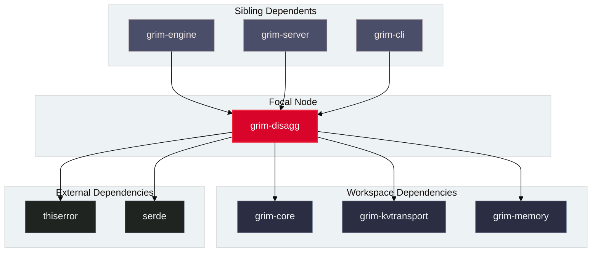

# grim-disagg

## Purpose

`grim-disagg` provides the distributed cluster disaggregation and KV routing subsystem for Grim. It separates prefill and decode phases of transformer execution across independent compute pools, and coordinates cross-node prefix matching and KV cache block migrations.

## Boundaries

`grim-disagg` does **not**:
- Execute neural network forward passes or compute kernels (delegated to `grim-engine` and backend crates).
- Perform physical socket or transport-level I/O directly (delegated to `grim-kvtransport`).
- Manage local GPU VRAM allocations or page tables (delegated to `grim-memory`).

## Dependency Graph



## Public API Overview

Exposed from `src/lib.rs`:

```rust
/// Cluster deployment roles for disaggregated inference nodes.
#[derive(Debug, Clone, Copy, PartialEq, Eq)]
pub enum PoolRole {
    Colocated,
    Prefill,
    Decode,
}

/// Core router for cross-node request dispatch and block transfers.
pub struct DisaggRouter {
    pub prefill_addr: String,
    pub decode_addr: String,
    pub role: PoolRole,
}

/// Cluster orchestrator managing prefill/decode node heartbeats and failover.
pub struct DisaggOrchestrator {
    // ...
}

/// Double-hashing Bloom filter for remote prefix lookup pre-filtering.
pub struct BloomFilter {
    // ...
}

impl BloomFilter {
    pub fn new(expected_items: usize, fp_rate: f64) -> Self;
    pub fn insert(&mut self, item: u64);
    pub fn contains(&self, item: u64) -> bool;
}

/// Remote lookup client using local Bloom filter summaries.
pub struct LookupClient {
    pub remote_bloom: BloomFilter,
    pub peer_addr: String,
}

/// Wire invalidation message for multi-node cache coherence.
pub struct InvalidationMsg {
    pub prefix_hash: u64,
    pub origin_node: u32,
    pub timestamp: u64,
}

/// Distributed cache coherence manager tracking multi-node invalidations.
pub struct CacheCoherenceManager {
    // ...
}
```

## Usage Example

```rust
use grim_disagg::{BloomFilter, CacheCoherenceManager, InvalidationMsg, PoolRole};

fn main() {
    // Create a 1% false-positive bloom filter for 10,000 cached prefixes
    let mut filter = BloomFilter::new(10_000, 0.01);
    filter.insert(0x1234_5678_9abc_def0);
    assert!(filter.contains(0x1234_5678_9abc_def0));

    // Encode and decode cache invalidations across cluster nodes
    let msg = InvalidationMsg {
        prefix_hash: 0x1234_5678_9abc_def0,
        origin_node: 1,
        timestamp: 1700000000,
    };
    let wire_bytes = msg.encode();
    assert_eq!(wire_bytes.len(), 20);

    let mut coherence = CacheCoherenceManager::new(1);
    coherence.handle_invalidation(msg).unwrap();
}
```

## Use Cases

- Splitting heavy prefill compute and memory-bandwidth-bound decode across distinct cluster pools.
- Filtering remote prefix queries locally via Bloom filters to avoid unnecessary network roundtrips.
- Broadcasting 20-byte wire invalidation messages across nodes to maintain cache coherence when token sequences are evicted or edited.

## Edge Cases, Limitations, and Quirks

1. **Bloom Filter Sizing**: The Bloom filter clamps false-positive rates between `0.00001` and `0.5` and hash counts between `1` and `30` to prevent memory blowup or degenerate CPU loop overheads.
2. **Fixed Wire Length**: `InvalidationMsg::decode` strictly requires exactly 20 bytes; slices with shorter or longer length return an error.
3. **Heartbeat Eviction**: `CacheCoherenceManager` evicts expired lease registrations after 30 seconds of inactivity.

## Build Flags, Feature Flags, and Environment Variables

- `default`: No special features.
