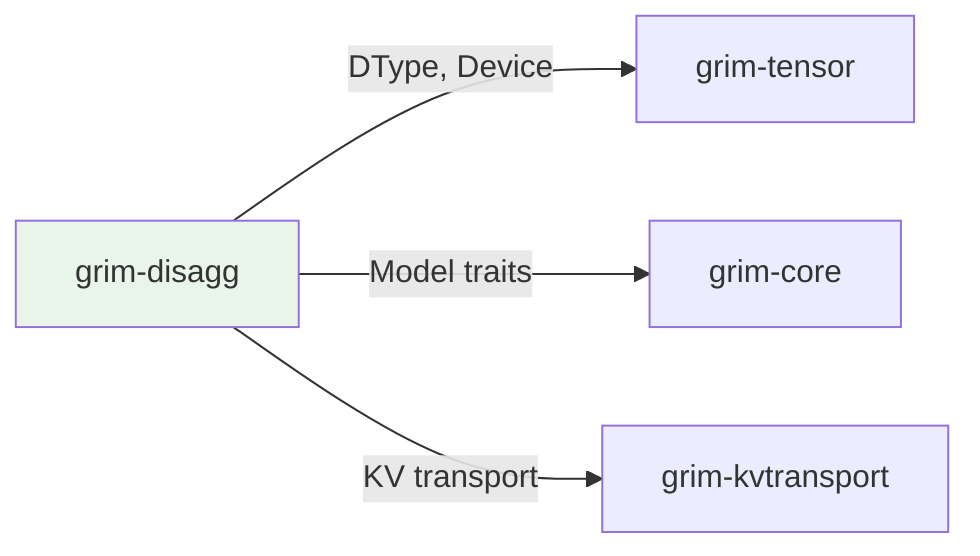

# grim-disagg

Distributed serving and disaggregation layer for Prefill and Decode decoupling in Grim.

## Purpose

Enables Prefill-Decode disaggregation:
- Separate resources for prompt processing (Prefill) and token generation (Decode)
- Network-transparent request routing
- KV cache transport between nodes

Supports scaling LLM serving across multiple machines with specialized hardware.

## Boundaries

- Does not perform inference — coordinates cross-node serving
- Does not define the Model trait — see `grim-core`
- Does not manage memory locally — that's `grim-memory`

## Dependency Graph



## Public API

### DisaggregationManager

```rust
pub struct DisaggregationManager {
    prefill_nodes: Vec<NodeInfo>,
    decode_nodes: Vec<NodeInfo>,
    router: RequestRouter,
}

pub struct NodeInfo {
    pub id: String,
    pub address: SocketAddr,
    pub capabilities: NodeCapabilities,
}

impl DisaggregationManager {
    pub fn new() -> Self;
    pub fn route_request(&self, req: &InferenceRequest) -> RouteDecision;
    pub fn migrate_request(&self, req_id: u64, target: &str) -> Result<()>;
}
```

### RequestRouter

Routes requests to optimal nodes based on:
- Request type (prefill vs decode)
- Resource availability
- KV cache location

## Usage Example

```rust
use grim_disagg::DisaggregationManager;

let manager = DisaggregationManager::new();
let route = manager.route_request(&request);

// Route to appropriate node
match route.node_type {
    NodeType::Prefill => send_to_prefill(&route.node, request),
    NodeType::Decode => send_to_decode(&route.node, request),
}
```

## Feature Flags

This crate has no feature flags.

## Edge Cases

1. **KV migration**: KV cache may need to move from prefill to decode node
2. **Network latency**: Requests routed to closest available node
3. **Node failure**: Automatic fallback to other available nodes