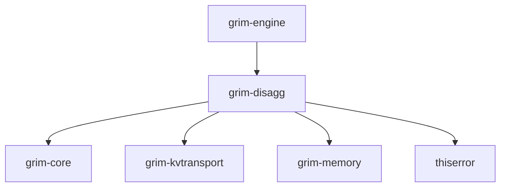

# grim-disagg

## Purpose
Provides the distributed serving and disaggregation layer for Grim. Decouples the prefill and decode phases of LLM generation, managing the cross-node routing and ReMP KV-cache migration required for scaled deployments.

## Boundaries
- Manages distributed node assignment and block routing.
- Re-uses `grim-kvtransport` for actual network I/O.
- Requires `grim-memory` for physical block storage layout.
- Does not execute model forward passes directly.

## Dependency Graph


## Public API Overview
- `DisaggRouter`: Core router for cross-pool dispatch and network KV transfers.
- `DisaggRouterT`: Trait abstracting dispatch functionality.
- `DisaggOrchestrator`: Cluster orchestrator managing prefill/decode roles, heartbeats, and dynamic colocated failover policies.
- `LayerPipelinedKvStreamer`: Asynchronous layer-by-layer KV streamer overlapping prompt prefill compute with network migration.
- `PoolRole`: Node deployment role (`Colocated`, `Prefill`, `Decode`).
- `ReMPMigrationBatch`: Struct managing 2D block-major data transfers.
- `KvReceiverServer`: Wrapping server for ingesting V2 protocol network blocks.
- `DisaggConfig`: Struct describing the cluster node map.

## Usage Example
```rust
use grim_disagg::{DisaggRouter, PoolRole};

let router = DisaggRouter::new("10.0.0.1:9000", "10.0.0.2:9000", PoolRole::Prefill);

// Assume request_id and tokens are available
// router.dispatch_prefill(request_id, &tokens).unwrap();
```

## Use Cases
- Separating heavy compute (prefill) and heavy memory bandwidth (decode) into distinct hardware clusters.
- Facilitating ReMP-style coalesced KV block migration within local memory pools.
- Load balancing long-context sequences across a multi-node backend.

## Edge Cases, Limitations, and Quirks
- `transfer_kv_colocated` enforces a check and returns an error if used outside of `PoolRole::Colocated`.
- Requires manual attachment of physical block pools via `with_pool` to avoid synthesizing fake data blocks.
- Network routing defaults to TCP; RDMA is an opt-in toggle without guaranteed backend support depending on the OS/hardware.

## Build Flags, Feature Flags, and Environment Variables
- `default`: No special features.
