# grim-engine

## Purpose
The `grim-engine` crate serves as the monolithic runtime core of the Grim framework. It wires together the scheduler, KV memory manager, model registry, speculative decoding wrappers, and the active hardware backends into a unified `Engine` struct. It handles the complete lifecycle of inference ticks, dispatching prefill and decode passes while mediating interactions with disaggregated KV routing and tensor-parallel cluster layers.

## Boundaries
This crate orchestrates and coordinates. It delegates actual tensor algebra to backend crates (`grim-backend-*`), memory allocation to `grim-memory`, and queue routing to `grim-scheduler`. While it owns the main loop state (like `sessions` and `models`), it avoids doing raw math or I/O directly, focusing entirely on state machine transitions.

## Dependency Graph

```mermaid
graph TD
    %% Focal Node
    grim-engine(("grim-engine"))

    %% Workspace Dependencies
    grim-engine --> grim-tensor
    grim-engine --> grim-core
    grim-engine --> grim-nn
    grim-engine --> grim-backend-cpu
    grim-engine --> grim-backend-rocm
    grim-engine --> grim-backend-cuda
    grim-engine --> grim-backend-metal
    grim-engine --> grim-memory
    grim-engine --> grim-scheduler
    grim-engine --> grim-models-transformer
    grim-engine --> grim-models-mamba
    grim-engine --> grim-models-vision
    grim-engine --> grim-format
    grim-engine --> grim-speculative
    grim-engine --> grim-kvquant
    grim-engine --> grim-autograd
    grim-engine --> grim-plugin
    grim-engine --> grim-disagg
    grim-engine --> thiserror

    %% External Dependencies
    grim-engine -.-> serde
    grim-engine -.-> serde_json

    %% Reverse Workspace Dependents
    grim-server --> grim-engine
    grim-cli --> grim-engine
```


## Public API Overview
- **`Engine` / `EngineConfig`**: The primary orchestrator handling configuration, model registration, and stepping the generation loop.
- **`LoadedModel` & `LoadedAdapter`**: Internal structs maintaining registered models and LoRA adapters.
- **`Engine::tick()`**: The main stepping function that polls the scheduler, dispatches prefills/decodes, manages speculative fallbacks, and tracks timing (TTFT/ITL).
- **`SpeculativeLoop`**: Driver for device-native rejection sampling and parallel Medusa / Eagle speculative candidate tree verification.
- **`Engine::register_model` / `register_with_dspark`**: Interfaces for loading raw auto-regressive models or models coupled with draft/Markov speculation heads.
- **`scythe2::*`**: Implementations for C²PLR continuous batching logic, PlacementCache, and ScytheRing operations.
- **`rope_scaling::*` / `streaming_forward::*` / `model_loader::*` / `packing::*`**: Various inference pipeline utilities.

## Usage Example
```rust
use grim_engine::{Engine, EngineConfig};

fn main() {
    let mut config = EngineConfig::default();
    config.max_batched_tokens = 2048;
    
    // Initialize the unified engine
    let mut engine = Engine::new(config);
    
    // In a real application, you would register models here:
    // engine.register_model("model_id", loaded_causal_lm);
    
    // Step the engine continuously in a server loop
    // loop {
    //     let outcome = engine.tick().unwrap();
    //     if outcome.is_empty() { break; }
    // }
}
```

## Use Cases
- Acting as the backend driver for the `grim-server` HTTP API.
- Hosting tensor-parallel distributed inference configurations where `grim-engine` coordinates multiple GPU processes via RCCL/NCCL.
- Implementing speculative decoding setups (like DSpark) that require tight coordination between draft head predictions and KV cache block verification.
- Enforcing KV Cache disaggregation, catching blocks broadcast from Pre-fill nodes over the network.

## Edge Cases, Limitations, and Quirks
- **Strict Speculative Wrapper Rule**: Models are forcefully wrapped in `SpeculativeCausalLm` at registration. Plain autoregressive decoding is treated merely as a fallback strategy if no draft heads are provided.
- **Tick Poisoning**: Engine panics during `tick()` are dangerous because they can poison the engine's internal Mutex, stalling all requests permanently. Therefore, tick errors are propagated as standard `Result` rather than panics.
- **Tensor-Parallel Initialization**: If `GRIM_TP_SIZE` > 1, the engine assumes exactly one OS process per rank. The configuration is validated strictly in `Engine::new()` and will hard-fail (panic) on invalid distributed config, avoiding silent mis-sharding.

## Build Flags, Feature Flags, and Environment Variables
- **Features**: `default = []`, `rocm-mem`.
- **Environment Variables**:
  - `GRIM_TP_SIZE` / `GRIM_GPUS`: Configures tensor-parallel world size and target ordinals.
  - `GRIM_KV_QUANT`: Triggers KV block quantization (`int8` or `int4`) via Lloyd-Max.
  - `GRIM_WEIGHT_STREAMING` / `GRIM_AVAILABLE_VRAM`: Configures on-the-fly model paging for memory-constrained environments.