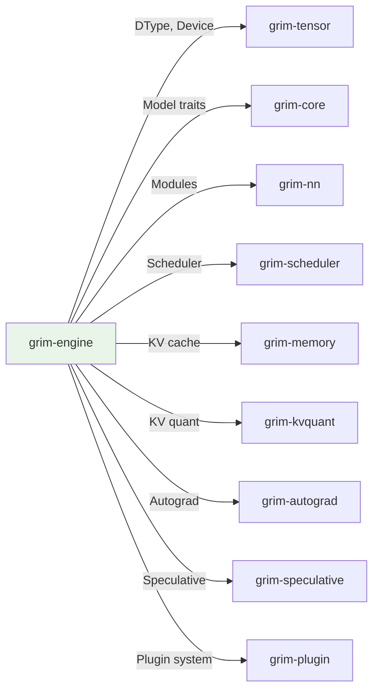

# grim-engine

Grim inference engine runtime. Wires the scheduler, memory manager, model registry, and executor into a single `Engine` struct.

## Purpose

The `Engine` is the top-level orchestrator that coordinates:
- The continuous-batching scheduler (`grim-scheduler`)
- The paged KV cache (`grim-memory`)
- The model registry (type-erased, keyed by model id)
- Adapter registry for LoRA serving

Downstream crates (`grim-server`) call `Engine::tick()` to advance one iteration.

## Boundaries

- Does not perform HTTP serving — see `grim-server`
- Does not define scheduler policies — see `grim-scheduler`
- Does not manage memory buffers directly — delegates to `grim-memory`

## Dependency Graph



## Public API

### EngineConfig

```rust
pub struct EngineConfig {
    pub max_batched_tokens: usize,
    pub max_num_seqs: usize,
    pub block_pool_capacity: usize,
    pub num_kv_heads: usize,
    pub head_dim: usize,
    pub target_ttft_ms: u64,
    pub target_itl_ms: u64,
    pub determinism_mode: DeterminismMode,
    pub kv_compressor: Option<Arc<dyn grim_kvquant::KvCompressor>>,
}

impl Default for EngineConfig {
    fn default() -> Self;
}
```

### Engine

```rust
pub struct Engine {
    pub config: EngineConfig,
    pub scheduler: Scheduler,
    pub block_pool: Arc<Mutex<KvBlockPool>>,
}

impl Engine {
    pub fn new(config: EngineConfig) -> Self;
    
    pub fn tokens_per_sec(&self) -> Option<f32>;
    pub fn kv_cache_telemetry(&self) -> (u64, u64, u64, u64);
    
    pub fn register_model(&mut self, id: &str, model: Box<dyn CausalLm>);
    pub fn register_with_dspark(&mut self, id: &str, model: Box<dyn CausalLm>,
                                draft: Arc<dyn DraftBackbone>, markov: Arc<dyn MarkovHead>,
                                confidence: Arc<dyn ConfidenceHead>);
    
    pub fn register_adapter(&mut self, base_model_id: &str, name: impl Into<String>,
                           handle: AdapterHandle);
    pub fn resolve_adapters(&self, ids: &[u32]) -> Option<Vec<AdapterHandle>>;
    pub fn drop_adapter(&mut self, id: u32) -> bool;
    pub fn adapter_count(&self) -> usize;
    pub fn get_adapter_by_name(&self, name: &str) -> Option<&LoadedAdapter>;
    
    pub fn loaded_models(&self) -> Vec<String>;
    pub fn unload_model(&mut self, name: &str) -> bool;
    pub fn strategy_for(&self, id: &str) -> Option<Strategy>;
    
    pub fn tick(&mut self) -> Result<SchedulerOutput>;
}
```

### StepOutcome

```rust
#[derive(Clone)]
pub struct StepOutcome {
    pub logits: Option<Arc<Tensor>>,
    pub accepted_tokens: usize,
    pub speculative: bool,
}
```

## Usage Example

```rust
use grim_engine::{Engine, EngineConfig};

let config = EngineConfig::default();
let mut engine = Engine::new(config);

// Register a model
engine.register_model("llama3", model);

// Run inference
let output = engine.tick()?;
let logits = output.last_outcome(request_id).and_then(|o| o.logits.as_ref());
```

## Feature Flags

This crate has no feature flags.

## Edge Cases

1. **Speculative decoding is default-on**: All causal models are wrapped in `SpeculativeCausalLm`
2. **Self-tuning**: Engine adapts `max_batched_tokens`, `speculative_block_len`, and `kv_compression_bit_width` at runtime
3. **Weight streaming**: Controlled by `GRIM_WEIGHT_STREAMING` env var