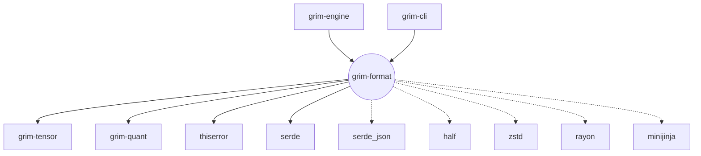

# grim-format

## Purpose
The `grim-format` crate provides model checkpoint parsers, tokenizers, metadata headers, and format converters for `.gguf`, `.safetensors`, and the native `.grim` format. It acts as the serialization and deserialization bridge for the Grim ecosystem, implementing `TensorProvider` so that the `WeightSource` can load physical tensors from disk into memory. It also handles chat templates via Jinja and manages training-state sidecar files (`.grim.train`).

## Boundaries
This crate strictly manages file I/O, parsing, layout metadata, and tokenization. It does *not* handle tensor math, inference graphs, or execution scheduling. It relies on `grim-tensor` for the foundational tensor types and `grim-quant` for reading quantized block structures, but it leaves dequantization execution to backend implementations where possible (unless pre-processing).

## Dependency Graph


## Public API Overview
- **`GgufProvider` & `GrimProvider`**: Implementations of `TensorProvider` for loading models.
- **`GgufTokenizer`**: Chat template rendering (via `minijinja`) and token encoding/decoding.
- **`gguf::*`**: Structs and enums for parsing GGUF magic, versions, metadata, and dtypes (`GgufFile`, `GrimMetadata`, `GGUF_MAGIC`).
- **`format::*` & `spec::*`**: Internal `.grim` format headers (`GrimHeader`, `GrimTensorEntry`, `GrimTensorExt`) and packing utilities.
- **`convert::*`**: Conversion utilities (`convert_gguf_to_grim`, `convert_to_grim_with_dequant`) mapping foreign formats to native layouts.
- **`train::*`**: Types for training state persistence (`TrainState`, `TrainFpFormat`).
- **`onnx::OnnxProvider`**: Provider for loading ONNX models.

## Usage Example
```rust
use grim_format::{GgufProvider, GgufTokenizer};
use std::path::Path;

fn main() -> Result<(), Box<dyn std::error::Error>> {
    let model_path = Path::new("model.gguf");
    
    // Load metadata and tensor headers
    let provider = GgufProvider::open(model_path)?;
    println!("Loaded model with {} tensors", provider.tensor_count());
    
    // Initialize tokenizer from the GGUF file
    let tokenizer = GgufTokenizer::from_gguf(&provider)?;
    let template = tokenizer.chat_template().unwrap_or_default();
    println!("Model chat template: {}", template);
    
    Ok(())
}
```

## Use Cases
- Loading a downloaded `.gguf` or `.safetensors` model checkpoint.
- Converting models from Hugging Face formats to the native `.grim` binary layout.
- Rendering conversational chat templates for a specific model before inference.
- Saving/loading adapter weights and optimizer momentum buffers during fine-tuning.

## Edge Cases, Limitations, and Quirks
- **Template Rendering**: The Jinja templating engine (`minijinja`) requires standard template strings. Highly customized Python-specific template quirks might need sanitization (`sanitize_jinja_template`).
- **Layout Hints**: During conversion, specific hardware layout hints (like `WavefrontTiled`) may be injected for ROCm/CUDA efficiency, meaning a `.grim` file converted for one hardware type might be suboptimal or fail to load on another if strict layouts are enforced.

## Build Flags, Feature Flags, and Environment Variables
- **Features**: Currently uses a `default = []` feature set.
- **Dev-Dependencies**: Pulls in `tempfile` and `grim-backend-cpu` for running format conversion and integrity tests locally.
