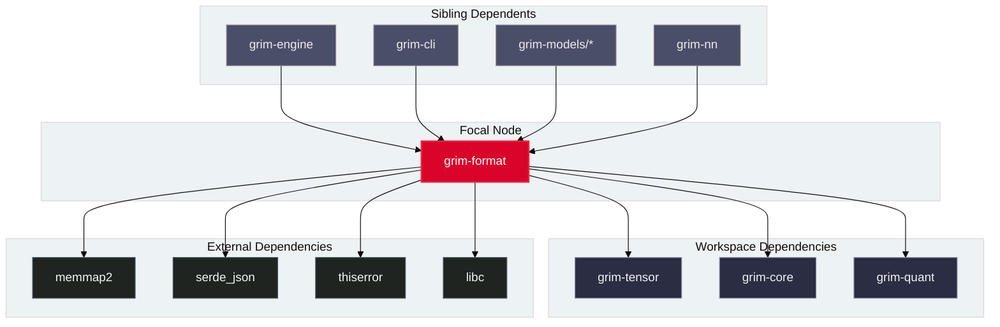

# grim-format

## Purpose

`grim-format` provides serialization, deserialization, and dynamic tensor extraction for neural network weight formats including GGUF, SafeTensors, PyTorch (`.pth`), AWQ/GPTQ quantized containers, and native `.grim` files. It also manages lazy virtual memory allocation and post-fill page pinning direct I/O for high-performance model loading.

## Boundaries

`grim-format` does **not**:
- Execute neural network compute kernels or GEMM operations (delegated to backend crates).
- Perform runtime continuous batching or sequence scheduling (delegated to `grim-scheduler`).
- Allocate or manage GPU VRAM device buffers (delegated to `grim-memory` and backend allocators).

## Dependency Graph



## Public API Overview

Exposed from `src/lib.rs`:

```rust
/// Tensor provider implementations for GGUF, SafeTensors, and native formats.
pub mod tprov {
    pub use super::gguf::GgufProvider;
    pub use super::safetensors::SafetensorsProvider;
}

/// Contiguous host RAM memory bank backed by mmap with post-fill pinning.
pub struct HostBank {
    // ...
}

impl HostBank {
    pub fn mmap_lazy(capacity: usize) -> Result<Self, Error>;
    pub fn fill_from_disk(&mut self, file: &mut std::fs::File, offset: u64, len: usize, flags: FillFlags) -> Result<usize, Error>;
    pub fn fill_from_slice(&mut self, data: &[u8]) -> Result<usize, Error>;
    pub fn pin(&mut self) -> Result<(), Error>;
    pub fn as_slice(&self) -> &[u8];
}

/// Flags controlling disk-to-host transfer behavior (Standard vs O_DIRECT).
#[derive(Debug, Clone, Copy, PartialEq, Eq)]
pub enum FillFlags {
    Standard,
    ODirect,
}
```

## Usage Example

```rust
use grim_format::bank::{HostBank, FillFlags};

fn main() -> Result<(), Box<dyn std::error::Error>> {
    // Allocate 64 MB of lazy uncommitted virtual address space
    let mut bank = HostBank::mmap_lazy(64 * 1024 * 1024)?;

    // Fill with tensor weight bytes
    let sample_weights = vec![0.5f32; 1024];
    let bytes: Vec<u8> = sample_weights.iter().flat_map(|f| f.to_le_bytes()).collect();
    bank.fill_from_slice(&bytes)?;

    // Pin memory pages into physical RAM after filling
    bank.pin()?;
    println!("HostBank populated and pinned: {} bytes", bank.as_slice().len());
    Ok(())
}
```

## Use Cases

- Reading GGUF, SafeTensors, and PyTorch checkpoint files directly into memory-mapped zero-copy tensor buffers.
- Loading massive MoE model weights into host system memory using uncommitted mmap and pinning pages only after data fill to avoid kernel zero-page overheads.
- Extracting quantized weights for AWQ, GPTQ, W8A8, and IQ schemes into format-agnostic `RawTensor` descriptors.

## Edge Cases, Limitations, and Quirks

1. **Memory Pinning Privileges**: `HostBank::pin()` calls `mlock` internally. On Linux environments where `RLIMIT_MEMLOCK` is constrained, pinning fails gracefully and falls back to unpinned pageable virtual memory.
2. **Direct I/O Sector Alignment**: Using `FillFlags::ODirect` requires the file offset and buffer length to be strictly aligned to the filesystem sector boundary (typically 4096 bytes).

## Build Flags, Feature Flags, and Environment Variables

- `default`: No special features.
