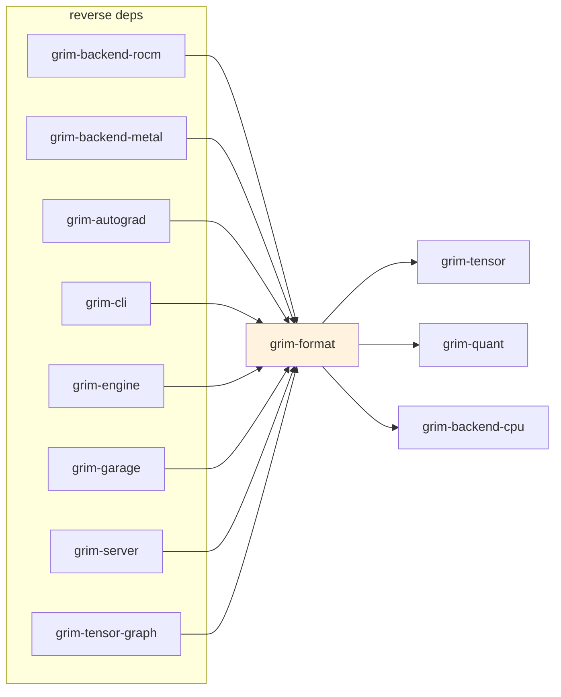

# grim-format

Model checkpoint parsers, tokenizers, metadata headers, and format converters (GGUF, `.grim` native, safetensors). Implements `TensorProvider` so weights can be loaded through the standard pipeline.

## Purpose

Handles model checkpoint I/O: reading GGUF files, safetensors, and native `.grim` format; writing Grim's native `.grim` artifacts (including training sidecars `.grim.train`); and providing `GgufTokenizer` for text encoding plus `ChatMessage`/`ToolDef`/`ToolChoice` types for tool-calling support.

## Boundaries

- Does **not** perform tensor computation — only I/O and parsing.
- Does **not** quantize weights at load time — dequant kernels live in `grim-backend-*` and `grim-quant`.
- Does **not** handle HTTP serving or model serving lifecycle — see `grim-server`.

## Dependency Graph



## Public API

### TensorProvider Implementations

```rust
pub struct GgufProvider { /* file reader, tensor index */ }
impl GgufProvider {
    pub fn open(path: &str) -> Result<Self>;
    pub fn metadata(&self, key: &str) -> Option<&GgufValue>;
    pub fn architecture(&self) -> Option<&str>;
    pub fn grim_metadata(&self) -> &GrimMetadata;
    pub fn tokenizer(&self) -> Result<GgufTokenizer>;
    pub fn tensors(&self) -> &HashMap<String, GgufTensorInfo>;
}
impl TensorProvider for GgufProvider { ... }

pub struct GrimProvider { /* native .grim reader */ }
impl GrimProvider {
    pub fn open(path: &str) -> Result<Self>;
    pub fn grim_metadata(&self) -> &GrimMetadata;
}
impl TensorProvider for GrimProvider { ... }
```

### Tokenizer and Chat Types

```rust
pub struct GgufTokenizer { /* fields */ }
pub struct ChatMessage { /* fields: role, content, ... */ }
pub struct ToolDef { /* fields */ }
pub struct FunctionDef { /* fields */ }
pub enum ToolChoice { Auto, None, Required }
pub struct FunctionName(pub String);
pub struct ToolCallMsg { /* fields */ }

pub fn render_chat_template(tokenizer: &GgufTokenizer, messages: &[ChatMessage],
    tools: Option<&[ToolDef]>, tool_choice: Option<&ToolChoice>) -> String;
pub fn render_messages_or_last(tokenizer: &GgufTokenizer, messages: &[ChatMessage]) -> String;
pub fn render_messages_or_last_with_tools(tokenizer: &GgufTokenizer, messages: &[ChatMessage],
    tools: Option<&[ToolDef]>, tool_choice: Option<&ToolChoice>) -> String;
```

### Conversion and Metadata

```rust
pub fn convert_gguf_to_grim(gguf_path: &str, out_path: &str, ...) -> Result<()>;
pub fn convert_to_grim(provider: &dyn TensorProvider, out_path: &str, ...) -> Result<()>;

pub struct GrimHeader { /* magic, version, tensor count */ }
pub struct GrimTensorEntry { /* name, dtype, shape, offset */ }

pub const FUCKING_SORCERY: [u8; 5] = [0x47, 0x52, 0x49, 0x4d, 0x01]; // "GRIM\x01" magic
```

### GGUF and Train Types

```rust
pub use gguf::{GgufFile, GgufValue, GgufDType, GrimMetadata, GrimFusionOp, GrimRocmlProfile, ...};
pub use train::{TrainState, TrainFpFormat};
```

## Usage Example

```rust
use grim_format::GgufProvider;

let provider = GgufProvider::open("model.gguf")?;
let tokenizer = provider.tokenizer()?;
let text = provider.architecture().unwrap_or("unknown");
```

## Feature Flags

This crate has no feature flags.

## Edge Cases, Limitations, and Quirks

- The GGUF magic bytes constant is named `FUCKING_SORCERY` in source (see `src/format.rs`) — used for the native `.grim` file header magic.
- `GgufTokenizer::render_chat_template` accepts an optional `tools`/`tool_choice` and emits a warning when tools are supplied but the chat template does not reference `tools` — the model still receives the prompt, but no tool-call structure is injected.
- `render_messages_or_last` falls back to the last message's content when no Jinja template is embedded in the GGUF metadata.
