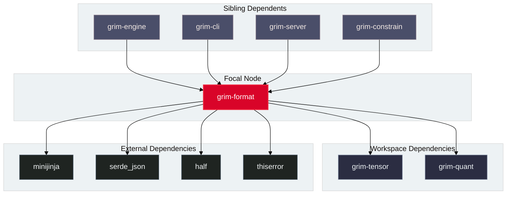

# `grim-format`

`grim-format` provides checkpoint parsers, tokenizers, metadata headers, and binary format converters for `.gguf`, `.safetensors`, and the native `.grim` container format in Grim. It implements `TensorProvider` to supply weights to `WeightSource` and manages training-state sidecars (`.grim.train`).

## Boundaries

`grim-format` does **not**:
- Allocate GPU VRAM or dispatch compute kernels (delegated to backend crates).
- Perform model forward passes or evaluate inference graphs (delegated to `grim-engine` and model crates).
- Implement training loops or compute gradients (delegated to `grim-autograd`).

## Dependency Graph



## Public API Overview

Exposed from `src/lib.rs`:

### Core Structs and Types

```rust
/// Provider interface for reading named tensor slices from container formats.
pub trait TensorProvider: Send + Sync {
    fn tensor_names(&self) -> Vec<String>;
    fn tensor_shape(&self, name: &str) -> Result<Shape, Error>;
    fn tensor_dtype(&self, name: &str) -> Result<DType, Error>;
    fn load_tensor(&self, name: &str) -> Result<Tensor, Error>;
    fn read_tensor_bytes(&self, name: &str) -> Result<Vec<u8>, Error>;
}

/// GGUF file container provider.
pub struct GgufProvider { /* ... */ }

/// Native .grim file container provider.
pub struct GrimProvider { /* ... */ }

/// Model footprint descriptor for pre-flight VRAM estimation.
#[derive(Debug, Clone, serde::Serialize, serde::Deserialize)]
pub struct ModelFootprint {
    pub architecture: Option<String>,
    pub parameter_count: u64,
    pub weight_bytes: u64,
    pub kv_cache_bytes_per_seq_token: u64,
    pub context_length: usize,
    pub hidden_size: usize,
    pub num_layers: usize,
    pub num_heads: usize,
    pub num_kv_heads: usize,
    pub vocab_size: usize,
}

impl ModelFootprint {
    pub fn from_gguf_file(path: &std::path::Path) -> Result<Self, Error>;
    pub fn from_grim_file(path: &std::path::Path) -> Result<Self, Error>;
}

/// Computes estimated VRAM bytes required for model weights, KV cache, and workspace memory.
pub fn estimate_vram_bytes(
    footprint: &ModelFootprint,
    context_tokens: usize,
    batch_size: usize,
) -> u64;

/// Native .grim header metadata container.
#[derive(Debug, Clone, PartialEq, serde::Serialize, serde::Deserialize)]
pub struct GrimMetadata {
    pub architecture: String,
    pub hidden_dim: u32,
    pub intermediate_dim: u32,
    pub num_layers: u32,
    pub num_heads: u32,
    pub num_kv_heads: u32,
    pub head_dim: u32,
    pub vocab_size: u32,
    pub context_length: u32,
    pub rope_theta: f32,
    pub rms_norm_eps: f32,
    pub preferred_dtype: Option<String>,
    pub gemm_backend: Option<String>,
    pub fp8: Option<bool>,
    pub multi_gpu_strategy: Option<String>,
}

/// Chat template tokenizer with MiniJinja support.
pub struct GgufTokenizer { /* ... */ }

impl GgufTokenizer {
    pub fn from_gguf(provider: &GgufProvider) -> Result<Self, Error>;
    pub fn encode(&self, text: &str) -> Result<Vec<u32>, Error>;
    pub fn decode(&self, tokens: &[u32]) -> Result<String, Error>;
    pub fn apply_chat_template(&self, messages: &[ChatMessage]) -> Result<String, Error>;
}

/// Sanitizes Python dict methods in Jinja templates to MiniJinja syntax.
pub fn sanitize_jinja_template(template: &str) -> String;
```

## Usage Example

```rust
use std::path::Path;
use grim_format::{GgufProvider, GgufTokenizer, ModelFootprint, estimate_vram_bytes};

fn main() -> Result<(), Box<dyn std::error::Error>> {
    let path = Path::new("models/llama-3-8b.gguf");
    
    // 1. Estimate VRAM footprint without loading all weights
    let footprint = ModelFootprint::from_gguf_file(path)?;
    let required_vram = estimate_vram_bytes(&footprint, 4096, 1);
    println!("Estimated VRAM needed: {} MB", required_vram / (1024 * 1024));

    // 2. Open GGUF provider and load tokenizer
    let provider = GgufProvider::open(path)?;
    let tokenizer = GgufTokenizer::from_gguf(&provider)?;
    let tokens = tokenizer.encode("Hello, Grim!")?;
    println!("Encoded {} tokens", tokens.len());

    Ok(())
}
```

## Use Cases

- Pre-flight memory verification via `grim doctor --model <path>`.
- Ingesting GGUF, SafeTensors, or native `.grim` model checkpoints into `grim-engine`.
- Sanitizing and rendering OpenAI-compatible chat messages into model prompt strings.
- Storing and restoring adapter weights and mixed-precision AdamW moments in `.grim.train` sidecars.

## Edge Cases, Limitations, and Quirks

1. **Jinja Template Compatibility**: Many Hugging Face chat templates use Python-specific idioms (`.get('key')`, `.items()`, `.startswith(...)`). `sanitize_jinja_template` transforms these expressions before evaluation by `minijinja`.
2. **Metadata Key Normalization**: GGUF keys vary across model architectures (e.g. `llama.block_count` vs `qwen2.block_count`). `GgufFile` implements fallback property getters that check architecture-prefixed keys.
3. **Format Alignment**: `.grim` files enforce 64-byte alignment on all tensor data offsets for direct GPU DMA copies.

## Build Flags, Feature Flags, and Environment Variables

- **Default features**: None.
- **Dependencies**: Uses `minijinja` for template evaluation and `serde`/`serde_json` for metadata serialization.
