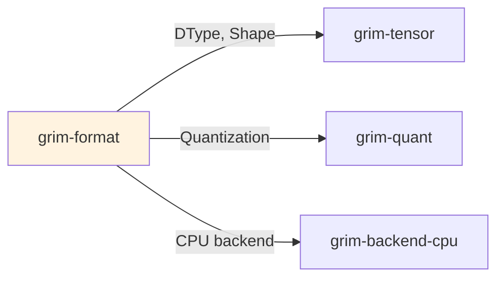

# grim-format

GGUF-compatible reader/writer and safetensors bridge for Grim. Implements TensorProvider so WeightSource can load real checkpoints.

## Purpose

This crate handles model checkpoint I/O: reading GGUF files, safetensors, and PyTorch binaries; and writing Grim's native `.grim` format. It implements the `TensorProvider` trait so weights can be loaded through the standard pipeline.

## Boundaries

- Does not perform computation — only I/O
- Does not quantize weights — dequantization happens in backends
- Does not handle training — only inference checkpoint loading

## Dependency Graph



## Public API

### GgufProvider

```rust
pub struct GgufProvider { /* private fields */ }

impl GgufProvider {
    pub fn open(path: &str) -> Result<Self>;
    pub fn tokenizer(&self) -> Result<Option<Tokenizer>>;
    pub fn load_tensor(&self, name: &str) -> Result<Tensor>;
    pub fn metadata(&self) -> &GgufMetadata;
}
```

### TensorProvider

```rust
pub trait TensorProvider {
    type Error;
    fn get(&self, name: &str) -> Result<(Tensor, Shape)>;
    fn names(&self) -> Vec<String>;
}
```

### GrimFormatWriter

Writes `.grim` files with Grim-specific metadata layer over GGUF format.

## Usage Example

```rust
use grim_format::GgufProvider;

let provider = GgufProvider::open("model.gguf")?;
let tokenizer = provider.tokenizer();
let weights = provider.load_tensor("layers.0.attn.weight")?;
```

## Feature Flags

| Flag | Default | Description |
|---|---|---|
| (none) | | |

## Edge Cases

1. **Tokenizer fallback**: If no Jinja template in metadata, falls back to last message content
2. **Safetensors**: Reads weight tensors but requires additional metadata for architecture
3. **PyTorch**: Supports `.bin` files for some architectures