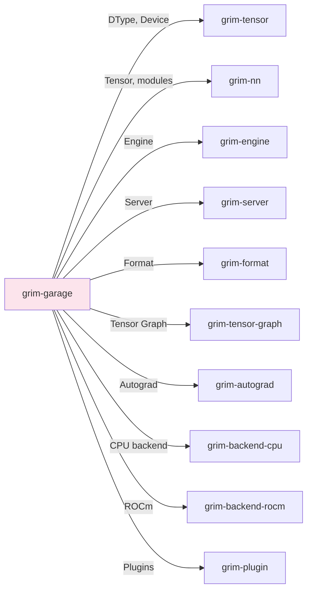

# grim-garage

Grim's Garage — local-first training dashboard & web app (Rust).

## Purpose

Provides a training dashboard with:
- Web-based UI for monitoring training jobs
- Native Rust CVKG UI for local job management
- Training execution and monitoring

Used for fine-tuning LoRA adapters and tracking training progress.

## Boundaries

- Is both a binary (`grim-garage`) and a library
- Does not perform inference — only training/fine-tuning
- Does not manage model serving — use `grim-server` for that

## Dependency Graph



## Public API

### GarageApp

```rust
pub struct GarageApp {
    engine: Engine,
    jobs: JobRegistry,
    ui: CvatDashboard,
}

pub struct JobConfig {
    pub base_model: String,
    pub dataset_path: PathBuf,
    pub epochs: usize,
    pub learning_rate: f32,
    pub rank: usize,
    pub alpha: f32,
    pub mode: String,
}
```

## Usage Example

```bash
# Start the training dashboard
grim-garage

# Or run training directly
grim train -m llama3 -d dataset.jsonl -o adapter.grim.train
```

## Feature Flags

| Flag | Default | Description |
|---|---|---|
| gpu-selection | - | Enable all GPU backends for training |

## Edge Cases

1. **GPU selection**: `gpu-selection` feature enables CUDA/Vulkan/Metal backends
2. **Training format**: Outputs QLoRA adapters as `.grim.train` sidecar files
3. **UI binding**: CVKG UI bindings may need platform-specific configuration