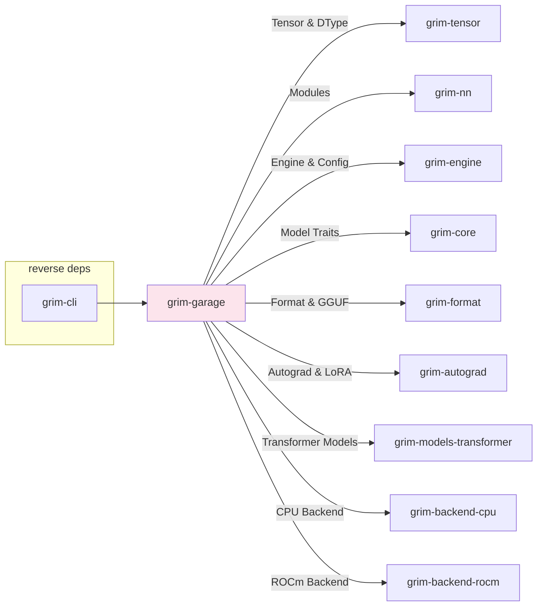

# grim-garage

Grim's Garage — local-first training dashboard & web application for Grim.

## Overview

`grim-garage` is an Axum-based HTTP web application and REST/SSE server that provides a local dashboard for managing, running, and monitoring fine-tuning jobs (LoRA, QLoRA, Vera, SoulEater, QGaLore, PISSA, OLORA) and tracking hardware telemetry on AMD ROCm GPUs and CPU/GPU backends.

## Purpose

- **Training Job Management**: Submit, start, inspect, and cancel local fine-tuning jobs across supported training modes (`LoRA`, `QLoRA`, `Vera`, `SoulEater`, `QGaLore`, `PISSA`, `OLORA`).
- **Real-Time Telemetry & SSE**: Streams loss curves, learning rate, GPU memory utilization, and throughput metrics in real time via Server-Sent Events (`/sse/metrics/:id`).
- **ROCm GPU Monitoring**: Probes device topology, VRAM allocation, and compute utilization on ROCm hardware via native HIP runtime bindings.
- **Model & Dataset Discovery**: Automatically scans local directories for datasets (`.jsonl`) and base checkpoints (`.gguf`, `.safetensors`, `.grim`).
- **Embedded Web UI**: Serves a bundled single-page web dashboard directly from the binary via `rust-embed` at `http://localhost:8741`.
- **Weight Export**: Exports trained adapter weights to standard `.grim.train` sidecars or merged GGUF checkpoints.

## Architecture

`grim-garage` operates as both a standalone executable (`grim-garage`) and a library crate:

- **Backend (`src/routes.rs`, `src/jobs.rs`)**: Axum routes, job registry, async training task spawner, and state management.
- **Hardware Probing (`src/rocm.rs`)**: ROCm GPU device probing and memory metric polling.
- **Data & Weight Helpers (`src/dataloader.rs`, `src/weight_format.rs`)**: JSONL dataset ingestion and adapter export helpers.
- **Client & Poller (`src/ui_state/`)**: Async polling client (`GarageClient`, `Poller`) and reactive state view-models (`DisplayState`) for the frontend UI.
- **Backend Selection (`src/backend.rs`)**: Device selection chain (ROCm → CUDA → Vulkan → Metal → CPU) with liveness probes.

## Dependency Graph



## HTTP Routes

### API Endpoints

| Method | Path | Description |
|--------|------|-------------|
| `GET` | `/` | Static web dashboard |
| `GET` | `/api/models` | List local models |
| `GET` | `/api/datasets` | List local datasets |
| `GET` | `/api/rocm/devices` | GPU probe |
| `POST` | `/api/train/start` | Create + start a training job |
| `GET` | `/api/train/jobs` | List jobs + statuses |
| `GET` | `/api/train/status/{id}` | Single-job snapshot |
| `POST` | `/api/train/cancel/{id}` | Request cancellation |
| `GET` | `/api/models/{id}/bolt-ons` | List bolt-on adapter status |
| `POST` | `/api/models/{id}/bolt-ons` | Attach bolt-on adapter |
| `DELETE` | `/api/models/{id}/bolt-ons/{slot}` | Detach bolt-on adapter |
| `SSE` | `/sse/metrics/{id}` | Live loss/VRAM events |

### Health & Utility Routes

| Method | Path | Description |
|--------|------|-------------|
| `GET` | `/health` | Health-check endpoint |
| `GET` | `/api/stats` | Aggregated stats endpoint |

## Public API & Data Models

### AppState (in `routes`)

```rust
use std::sync::Arc;
use grim_garage::routes::{AppState, build_router};
use grim_garage::jobs::JobRegistry;
use grim_engine::Engine;

pub struct AppState {
    pub registry: Arc<JobRegistry>,
    pub engine: Arc<std::sync::Mutex<Engine>>,
    pub tokenizer: Arc<std::sync::Mutex<Option<GgufTokenizer>>>,
    pub model_path: Option<std::path::PathBuf>,
}

let state = AppState {
    registry: Arc::new(JobRegistry::new()),
    engine: Arc::new(std::sync::Mutex::new(Engine::default())),
    tokenizer: Arc::new(std::sync::Mutex::new(None)),
    model_path: None,
};

let router = build_router(state);
```

### Jobs

```rust
pub struct TrainingJob {
    pub id: JobId,
    pub config: UiTrainingConfig,
    pub status: JobStatus,
    pub metrics: Vec<Metric>,
}

pub enum TrainingMode {
    LoRA,
    QLoRA,
    Vera,
    SoulEater,
    QGaLore,
    PISSA,
    OLORA,
}

pub enum JobStatus {
    Pending,
    Running,
    Paused,
    Cancelled,
    Completed,
    Failed,
}

pub struct Metric {
    pub step: u64,
    pub loss: f64,
    pub tokens: u64,
}

pub struct JobRegistry {
    // thread-safe job store with concurrent execution limits
}

impl JobRegistry {
    pub fn new() -> Self;
    pub fn with_max_concurrent(max_concurrent: usize) -> Self;
    pub async fn running_count(&self) -> usize;
    pub async fn create(&self, job: TrainingJob) -> Result<JobId, JobError>;
}
```

### Discovery

```rust
pub struct ModelEntry {
    pub id: String,
    pub name: String,
    pub path: String,
    pub format: String,
    pub is_grim: bool,
    pub size_bytes: u64,
}

pub struct DatasetEntry {
    pub id: String,
    pub path: String,
    pub format: String,
    pub size_bytes: u64,
}

pub fn discover_models(dir: &Path) -> Result<Vec<ModelEntry>, DiscoveryError>;
pub fn discover_datasets(dir: &Path) -> Result<Vec<DatasetEntry>, DiscoveryError>;
pub fn default_models_dir() -> PathBuf;
pub fn default_datasets_dir() -> PathBuf;
```

### ROCm Device Info

```rust
pub struct RocmDeviceInfo {
    pub ordinal: u32,
    pub name: String,
    pub vendor: String,
    pub backend: String,
    pub is_rocm_compliant: bool,
    pub gcn_arch: String,
    pub vram_bytes: u64,
    pub vram_used_bytes: u64,
    pub wavefront_size: u32,
    pub wmma_supported: bool,
    pub mfma_supported: bool,
    pub xnack_enabled: bool,
    pub compute_units: u32,
    pub max_threads_per_block: u32,
}

pub fn probe_rocm_devices() -> Vec<RocmDeviceInfo>;
```

## Running

```bash
# Run the garage dashboard server on default port 8741
cargo run -p grim-garage --release

# Bind to a custom address via environment variable or flag
GRIM_GARAGE_BIND_ADDR="127.0.0.1:9090" cargo run -p grim-garage
```

## Feature Flags

| Flag | Default | Description |
|---|---|---|
| `gpu-selection` | Disabled | Enables CUDA, Vulkan, and Metal backend crates alongside default ROCm & CPU support |

## Edge Cases, Limitations, and Quirks

- ROCm and CPU are always in the build (ROCm is grim's primary GPU target, CPU is the ultimate reference fallback). CUDA / Vulkan / Metal are gated behind the `gpu-selection` cargo feature so SDK toolchains aren't forced into builds that don't want them.
- Metal is Apple-only: off Linux it compiles but its device is CPU-backed, so it is never selected as a live GPU.
- The ROCm device probe requires a live `rocm-smi` or HIP runtime — absent either, the probe returns an empty list.
