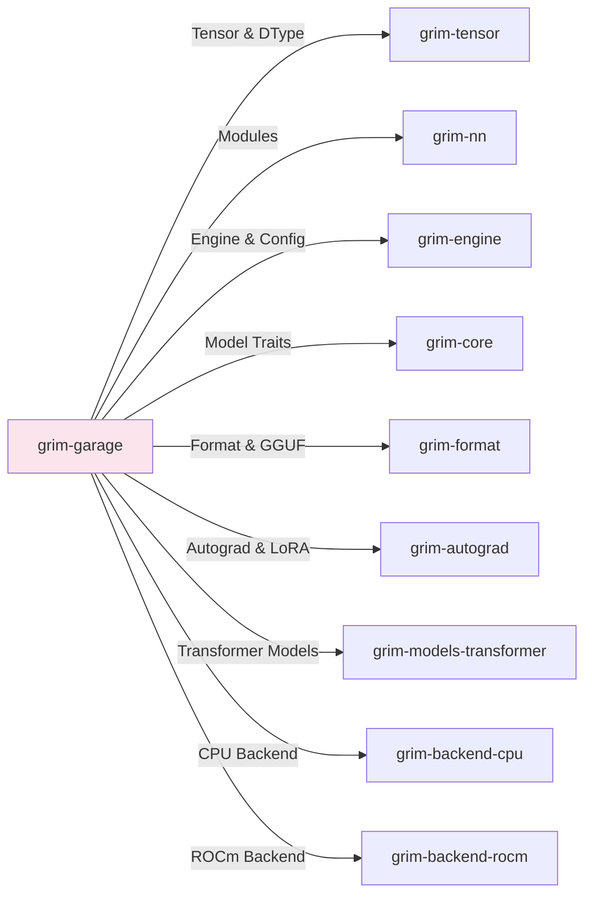

# grim-garage

Grim's Garage — local-first training dashboard & web application for Grim.

## Overview

`grim-garage` is an Axum-based HTTP web application and REST/SSE server that provides a local dashboard for managing, running, and monitoring fine-tuning jobs (LoRA, QLoRA, Vera, SoulEater, QGaLore, PISSA, OLORA) and tracking hardware telemetry on AMD ROCm GPUs and CPU/GPU backends.

## Features

- **Training Job Management**: Submit, start, inspect, and cancel local fine-tuning jobs across supported training modes (`LoRA`, `QLoRA`, `Vera`, `SoulEater`, `QGaLore`, `PISSA`, `OLORA`).
- **Real-Time Telemetry & SSE**: Streams loss curves, learning rate, GPU memory utilization, and throughput metrics in real time via Server-Sent Events (`/sse/metrics/:id`).
- **ROCm GPU Monitoring**: Probes device topology, VRAM allocation, and compute utilization on ROCm hardware via native HIP runtime bindings.
- **Model & Dataset Discovery**: Automatically scans local directories for datasets (`.jsonl`) and base checkpoints (`.gguf`, `.safetensors`, `.grim`).
- **Embedded Web UI**: Serves a bundled single-page web dashboard directly from the binary via `rust-embed` at `http://localhost:8741`.
- **Weight Export**: Exports trained adapter weights to standard `.grim.train` sidecars or merged GGUF checkpoints.

## Architecture

`grim-garage` operates as both a standalone executable (`grim-garage`) and a library crate:

- **Backend (`src/routes.rs`, `src/jobs.rs`)**: Axum routes, job registry, async training task spawner, and state management.
- **Hardware Probing (`src/rocm.rs`)**: ROCm GPU device probing and memory metric polling.
- **Data & Weight Helpers (`src/dataloader.rs`, `src/weight_format.rs`)**: JSONL dataset ingestion and adapter export helpers.
- **Client & Poller (`src/ui_state/`)**: Async polling client (`GarageClient`, `Poller`) and reactive state view-models (`DisplayState`) for the frontend UI.

## Dependency Graph



## Public API & Data Models

### App State & Routes

```rust
use std::sync::Arc;
use grim_garage::routes::{AppState, build_router};
use grim_garage::jobs::JobRegistry;
use grim_engine::Engine;

let state = AppState {
    registry: Arc::new(JobRegistry::new()),
    engine: Arc::new(std::sync::Mutex::new(Engine::default())),
    tokenizer: Arc::new(std::sync::Mutex::new(None)),
    model_path: None,
};

let router = build_router(state);
```

### Job Configuration

```rust
pub struct TrainingJob {
    pub id: JobId,
    pub config: UiTrainingConfig,
    pub status: JobStatus,
    pub metrics: Vec<Metric>,
}

pub enum TrainingMode {
    LoRA,
    QLoRA,
    Vera,
    SoulEater,
    QGaLore,
    PISSA,
    OLORA,
}
```

## Running

```bash
# Run the garage dashboard server on default port 8741
cargo run -p grim-garage --release

# Bind to a custom address via environment variable or flag
GRIM_GARAGE_BIND_ADDR="127.0.0.1:9090" cargo run -p grim-garage
```

## Feature Flags

| Flag | Default | Description |
|---|---|---|
| `gpu-selection` | Disabled | Enables CUDA, Vulkan, and Metal backend crates alongside default ROCm & CPU support |