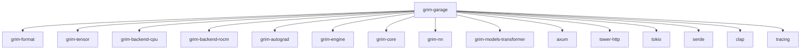
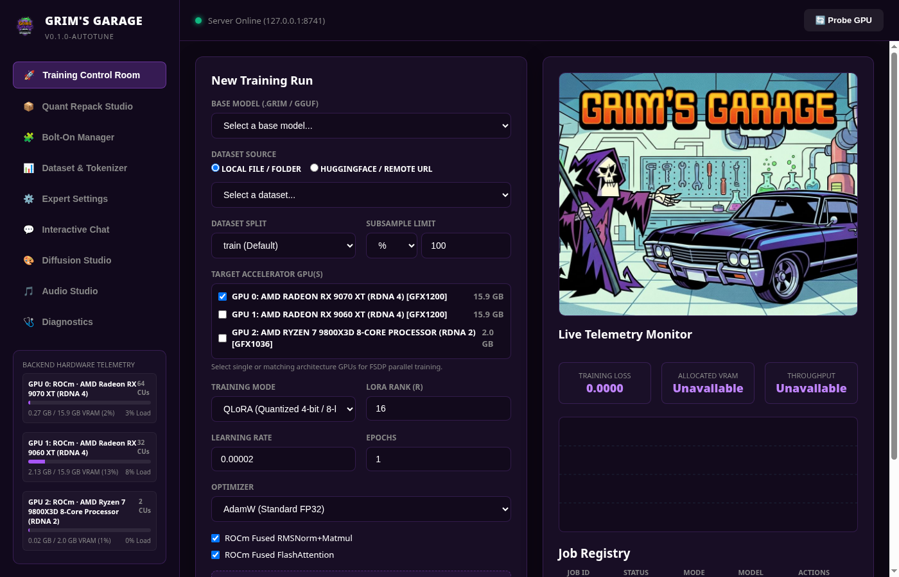

# grim-garage

## Purpose
Grim's Garage is a local-first training dashboard and web application for Grim. It provides a visual interface and backend API (via Axum) to discover models, configure datasets, launch local fine-tuning jobs (like QLoRA), and monitor training metrics in real-time.

## Boundaries
- Serves as the orchestration layer and user interface.
- Executes HTTP REST API and Server-Sent Events (SSE) for metrics.
- Ties together `grim-engine` and `grim-autograd` but delegates actual tensor computation to them.
- Defaults to loopback (`127.0.0.1:8741`) for secure local operation.

## Dependency Graph


## Public API Overview
- `JobRegistry`: Shared state tracking active and historical training jobs.
- `TrainingJob`: Struct representing a dispatched fine-tuning task.
- `UiAppState` / `GarageClient`: Core client/server states.
- `MetricStreamEvent`: SSE payloads for real-time loss and throughput graphs.
- `probe_rocm_devices`: Utility for identifying local AMD hardware limits.

## Training Control Room UI



## Usage Example
```bash
# Start the Garage server
cargo run --bin grim-garage -- --port 8741
```
*(No standard rust library usage provided as this crate is primarily an application binary.)*

## Use Cases
- Visualizing QLoRA loss curves in real-time.
- Managing multiple local fine-tuning experiments.
- Inspecting discovered `grim-format` models and compatible instruction datasets.

## Edge Cases, Limitations, and Quirks
- Designed exclusively for single-node local execution.
- Metrics are streamed via SSE and do not currently persist to a rigorous external time-series database across restarts.
- ROCm and CPU backends are always available; Metal, CUDA, and Vulkan are subject to build configurations.

## Build Flags, Feature Flags, and Environment Variables
- `default`: Base web server configuration.
- `gpu-selection`: Turns on the optional backend crates (`cuda`, `vulkan`, `metal`) and activates the dispatch layer in `grim-autograd`.
