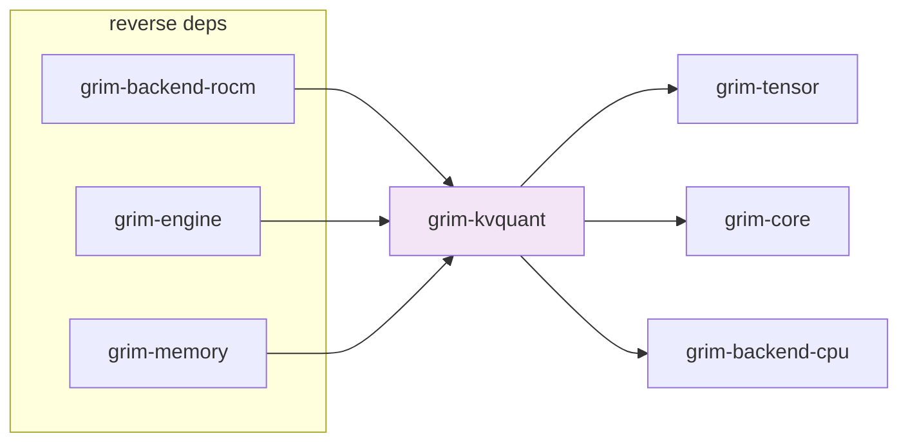

# grim-kvquant

Runtime KV cache compression — compresses *runtime* KV blocks inside `grim-memory`'s block pool. Distinct from `grim-quant` (which compresses model weights at save time). §5.4.

## Purpose

Provides the `KvCompressor` trait and its implementations (`IdentityCompressor`, `LloydMaxCompressor`) for compressing key/value cache tensors in place. Integrates with `grim-memory`'s `KvBlockPool` to apply compression before block eviction/demotion and decompression before attention compute. Also provides `KvOmniConfig` for multi-modality-aware eviction scoring and `ModalityPolicy` for KV-OMNI routing.

## Boundaries

- Does **not** define the `KvCache` trait — that is in `grim-core`.
- Does **not** manage memory allocation — see `grim-memory`.
- Does **not** compress model weights — see `grim-quant`.

## Dependency Graph



## Public API

```rust
pub mod kv_omni;
pub use kv_omni::{KvOmniConfig, KvOmniEvictor, ModalityPolicy, OmniKvCompressor};

pub trait KvCompressor: Send + Sync {
    fn compress(&self, keys: &Tensor, values: &Tensor) -> Result<CompressedKvBlock>;
    fn dequantize_for_attention(&self, block: &CompressedKvBlock,
        device: &dyn BackendDevice, device_type: Device) -> Result<(Tensor, Tensor)>;
    fn fused_attention(&self, /* params */) -> Result<Tensor>;
}

pub struct CompressedKvBlock { /* compressed bytes + metadata */ }
pub struct KvQuantConfig { /* fields */ }
pub struct KvDequantAttentionConfig { /* fields */ }
pub struct KvBlockOnDisk { /* fields */ }

pub struct LloydMaxCompressor { /* fields */ }
impl LloydMaxCompressor { /* impl KvCompressor */ }

pub struct IdentityCompressor;
impl KvCompressor for IdentityCompressor { /* no-op */ }

pub enum KvModality { /* text, vision, audio variants */ }

pub fn random_orthogonal_matrix(dim: usize, seed: u64) -> Vec<f32>;
pub fn apply_rotation(data: &[f32], rotation: &[f32], dim: usize, count: usize) -> Vec<f32>;
```

## Usage Example

```rust
use grim_kvquant::{IdentityCompressor, KvCompressor};
use grim_tensor::Tensor;

let compressor = IdentityCompressor;
let compressed = compressor.compress(&keys, &values)?;
let (k, v) = compressor.dequantize_for_attention(
    &compressed, &device, device_type)?;
```

## Feature Flags

This crate has no feature flags.

## Edge Cases, Limitations, and Quirks

- `IdentityCompressor` is the no-op default — `LloydMaxCompressor` must be explicitly configured.
- `compressed_attention` methods accept a `BackendDevice` for fused dequant+attention — if the backend doesn't provide a fused kernel, callers must call `dequantize_for_attention` separately.
- KV-OMNI modality routing uses `KvModality` tags and per-modality importance weights to decide which KV blocks to evict under memory pressure.
