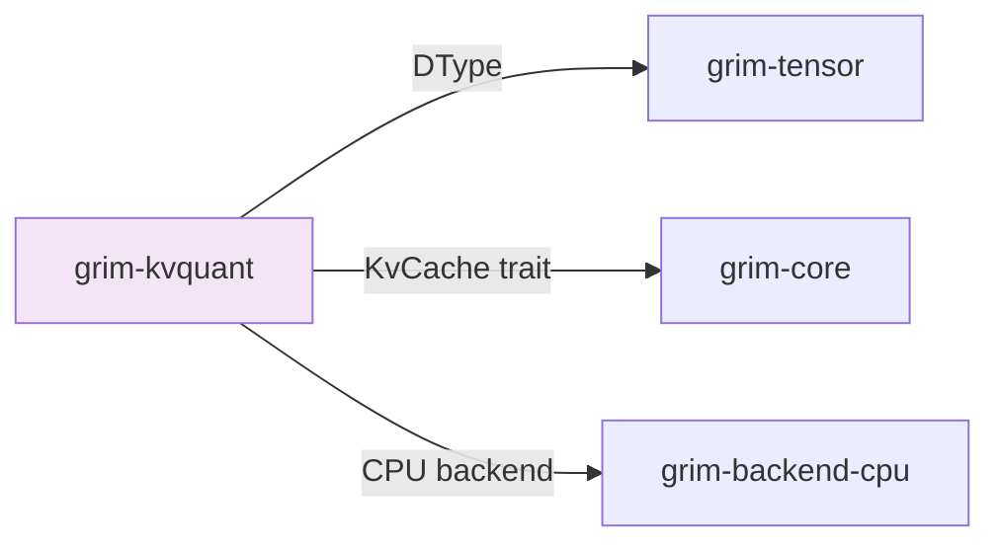

# grim-kvquant

Runtime KV cache compression for Grim — TurboQuant-style rotation + Lloyd-Max scalar quant + QJL residual + group quant. §5.4.

## Purpose

Provides runtime compression for KV cache states to reduce memory usage during long-context inference. Uses:
- TurboQuant rotation for entropy coding
- Lloyd-Max scalar quantization for optimal bit allocation
- QJL (Quantization with Joint Loss) residuals for improved accuracy

## Boundaries

- Does not perform inference — only compresses KV states
- Does not define the KV cache interface — see `grim-core::KvCache`
- Does not handle memory allocation — see `grim-memory`

## Dependency Graph



## Public API

### KvCompressor

```rust
pub trait KvCompressor: Send + Sync {
    fn compress_k(&self, k: &[f32]) -> CompressedKv;
    fn decompress_k(&self, compressed: &CompressedKv) -> Vec<f32>;
    fn bits_per_key(&self) -> f32;
}

pub struct TurboQuantCompressor {
    // TurboQuant-style rotation + Lloyd-Max quant
}

impl KvCompressor for TurboQuantCompressor { /* ... */ }
```

## Usage Example

```rust
use grim_kvquant::TurboQuantCompressor;

let compressor = TurboQuantCompressor::new(4.0); // 4 bits per key
let compressed = compressor.compress_k(&kv_state);
let decompressed = compressor.decompress_k(&compressed);
```

## Feature Flags

This crate has no feature flags.

## Edge Cases

1. **Bit-width trade-off**: Higher compression = more VRAM savings but lower accuracy
2. **Speculative slots**: Compressed KV must decompress before speculative acceptance
3. **Lloyd-Max optimization**: Optimal quantization levels computed per tensor