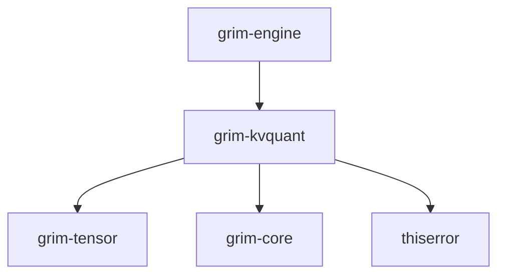

# grim-kvquant

## Purpose
Provides runtime KV cache compression for Grim. Uses TurboQuant-style rotation, Lloyd-Max scalar quantization, and variable group quantization to minimize memory bandwidth and footprint during autoregressive decoding.

## Boundaries
- Only compresses runtime cache blocks inside `grim-memory`.
- Distinct from `grim-quant` which handles static model weight compression.
- Format metadata mappings are abstracted into `KvBlockOnDisk` rather than coupling with `grim-format`.

## Dependency Graph


## Public API Overview
- `LloydMaxCompressor`: Main compression handler.
- `KvCompressor`: Core trait for KV block compression and fused dequantization/attention.
- `CompressedKvBlock`: Struct storing packed low-bit representations.
- `KvModality`: Enum mapping cache modality (Text, Audio, Visual) for OMNI routing.
- `KvQuantConfig`: Struct configuring bit density and group size.

## Usage Example
```rust
use grim_kvquant::{LloydMaxCompressor, KvQuantConfig};

let config = KvQuantConfig {
    key_bits: 4,
    value_bits: 4,
    group_size: 64,
    qk_compute_bits: 8,
};
let compressor = LloydMaxCompressor::new(config);

// Usage assumes populated key and value tensors:
// let compressed = compressor.compress(&keys, &values).unwrap();
```

## Use Cases
- Reducing peak memory for long-context generation.
- Fusing attention and dequantization on GPUs.
- Variable bit-rate quantization tuned per cache block or modality.

## Edge Cases, Limitations, and Quirks
- Fused GPU attention relies on specific kernel support in `grim-backend-*` (e.g., HIP/ROCm implementation).
- Sub-4-bit quantization pathways mandate an even head dimension.
- Employs random orthogonal matrices based on a deterministic seed for key pre-rotation.

## Build Flags, Feature Flags, and Environment Variables
- `default`: No special features.
