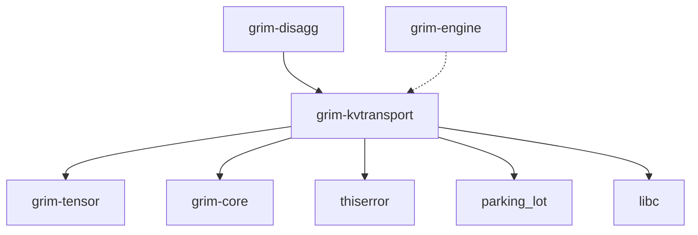

# grim-kvtransport

## Purpose
Provides tiered KV cache local transport, spillage, and network transport mechanisms. Handles moving KV block contents between GPU, Host RAM, and local scratch NVMe files, and implements the wire protocol for cross-node KV cache handoffs.

## Boundaries
- Executes local filesystem spills and TCP network block transfers.
- Defines the `KvBlockStore` trait to decouple from `grim-memory` while providing network ingestion servers.
- Does not dictate the eviction algorithm (managed by callers).

## Dependency Graph


## Public API Overview
- `LocalSpillManager` & `SharedSpillManager`: Tiered NVMe/RAM block spilling.
- `NetworkKvClient`: TCP client for V2 wire protocol block transfers.
- `start_kv_receiver_server`: Background TCP server for remote KV block ingestion.
- `KvBlockStore`: Abstract trait implemented by `grim-memory` pools.
- `NvmeWeightStreamer`: Double-buffered async layer weight prefetcher.
- `grimvise_advise`: OS-level `madvise` helper for memory hinting.

## Usage Example
```rust
use grim_kvtransport::{LocalSpillManager, CacheTier};
use std::path::PathBuf;

let scratch_dir = PathBuf::from("/tmp/grim-spill");
// 1024 represents block elements
// let mut manager = LocalSpillManager::new(scratch_dir, 1024).unwrap();

// manager.demote_to_host(1, vec![0.0; 1024], vec![0.0; 1024]).unwrap();
// manager.demote_to_nvme(1).unwrap();
```

## Use Cases
- Spilling cache blocks to host memory or NVMe when VRAM is exhausted.
- Sending KV blocks between prefill and decode nodes in a disaggregated cluster.
- Streaming model weights directly from NVMe to bypass RAM limits.

## Edge Cases, Limitations, and Quirks
- The NVMe weight streamer relies on synchronous file I/O until `io_uring` is implemented.
- `grimvise_advise` is a no-op on platforms without `madvise` (like Windows).
- Network transfers use unencrypted TCP; suitable for secure private clusters only.

## Build Flags, Feature Flags, and Environment Variables
- `default`: No special features.
